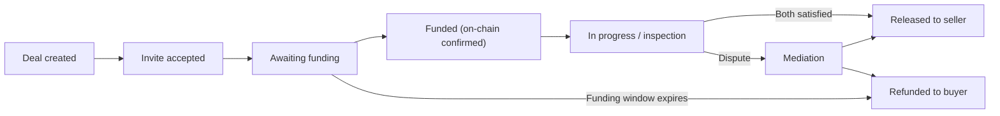

<div align="center">

# TrustVexa

**A crypto-only, Render-hosted escrow platform for safe peer-to-peer deals.**

Buyer funds are held in escrow, released only when both sides are satisfied — with
server-side money math, a double-entry ledger, and a transparent fee model.

[Architecture](docs/ARCHITECTURE.md) · [Contributing](CONTRIBUTING.md) · [Security](SECURITY.md) · [Changelog](CHANGELOG.md)


</div>

---

## What is TrustVexa?

TrustVexa is an escrow service for crypto transactions. A **buyer** and a **seller**
agree on a deal; the buyer deposits funds into a platform-controlled escrow address;
the platform watches the chain for confirmation; and funds are released to the seller
(or refunded to the buyer) according to a strict, auditable state machine. An optional
**middleman** can mediate disputes.

Design principles that are enforced throughout the codebase:

- **Server-side money only.** All fee, ledger, and payout math runs on the server in
  **integer smallest units** — never floating point, never trusted from the client.
- **Double-entry ledger.** Every movement of value is recorded as balanced debits and
  credits. Balances are derived, never hand-edited.
- **One source of truth.** PostgreSQL (3NF) holds all durable money state. Redis holds
  only ephemeral state (rate limits, token denylist, presence, queues, locks, cache).
- **Render-only.** The entire stack deploys from a single `render.yaml` blueprint.


---

## Table of contents

- [Features](#-features)
- [Tech stack](#-tech-stack)
- [Monorepo layout](#-monorepo-layout)
- [Quick start](#-quick-start)
- [Configuration](#-configuration)
- [Database & migrations](#-database--migrations)
- [Testing & quality](#-testing--quality)
- [Deployment (Render)](#-deployment-render)
- [How escrow works](#-how-escrow-works)
- [Fees](#-fees)
- [Security](#-security)
- [Documentation](#-documentation)
- [License](#-license)

---

## ✨ Features

- **Accounts & auth** — email/password registration, Argon2 hashing, breached-password
  and reserved-name checks, **Google OAuth** login, JWT access/refresh with rotation,
  a `jti` denylist enforced on both REST and WebSockets, brute-force lockout, and
  step-up verification for sensitive actions.
- **Deal lifecycle** — creation with amount bounds, drafts, duplication, invite +
  acceptance, a 20-state deal **state machine**, inspection windows, funding windows,
  and SLA timers driven by a background worker.
- **Money** — integer smallest-unit primitives, a tiered fee engine, a double-entry
  ledger, payments, payouts/refunds, gas pass-through, and custody accounting.
- **Real-time chat & notifications** — Socket.IO with JWT auth and a Redis adapter,
  presence, per-deal rooms, and web-push notifications.
- **Dashboards** — buyer/seller/middleman and operator views.
- **Public site & legal** — marketing pages, Terms/Privacy with versioned acceptance,
  prohibited-use and screening policies.
- **Launch & ops controls** — feature flags, emergency pause switches, practice
  (testnet) mode, an onboarding checklist, a go-live gate, health roll-ups, alerting,
  and a dead-letter queue with exponential backoff.
- **PWA** — installable Next.js front end with offline support and accessibility
  (WCAG 2.1 AA) checks.

---

## 🧱 Tech stack

| Layer            | Technology                                                                 |
| ---------------- | -------------------------------------------------------------------------- |
| Frontend         | Next.js, React, Tailwind CSS, shadcn/ui (installable PWA)                   |
| API              | Node.js, Express (routes → controllers → services → repositories)           |
| Worker           | BullMQ jobs, blockchain watchers, SLA/timer sweeps                         |
| Realtime         | Socket.IO (JWT-authenticated) + `@socket.io/redis-adapter`                 |
| Data             | PostgreSQL (3NF, source of truth) + Redis (ephemeral)                      |
| Chains           | ethers.js (ETH/BNB), TronWeb (TRON), Solana web3.js (SOLANA)               |
| Validation       | Zod (shared schemas)                                                       |
| Language / tools | TypeScript (strict), pnpm workspaces, ESLint, Prettier, Vitest, fast-check |
| Hosting          | Render (web + api + worker + managed PostgreSQL + managed Redis)           |

**Supported coins:** USDT, SOL, BNB, ETH, TRX — **networks:** ETH, BNB, TRON, SOLANA.

---

## 📁 Monorepo layout

```
trustvexa/
├─ apps/
│  ├─ web/      # @trustvexa/web    — Next.js PWA front end
│  ├─ api/      # @trustvexa/api    — Express HTTP + Socket.IO API
│  └─ worker/   # @trustvexa/worker — BullMQ jobs, chain watchers, timers
├─ packages/
│  ├─ shared/   # @trustvexa/shared — cross-cutting types & helpers (hashing, redis, money)
│  └─ db/       # @trustvexa/db     — SQL migrations & seed data
├─ docs/        # architecture, incident response, security hardening
├─ kiro/        # product spec: requirements.md, design.md, tasks.md
├─ render.yaml  # Render blueprint (infra as code)
└─ .github/     # CI/CD workflows, security scanning, issue/PR templates
```

The authoritative product spec lives in
[`kiro/specs/trustvexa-escrow-platform/`](kiro/specs/trustvexa-escrow-platform/)
(`requirements.md`, `design.md`, `tasks.md`). **All 118 build tasks are complete.**

---

## 🚀 Quick start

### Prerequisites

- **Node.js >= 20**
- **pnpm 9.15.9** (`corepack enable && corepack prepare pnpm@9.15.9 --activate`)
- A local **PostgreSQL** and **Redis** (or Docker equivalents)

### Install & configure

```bash
# 1. Install all workspace dependencies
pnpm install --frozen-lockfile

# 2. Create your local environment file
cp .env.example .env
# then fill in DATABASE_URL, REDIS_URL, and the secrets you need locally

# 3. Apply database migrations
pnpm migrate:up
```

### Run in development

```bash
# Run each service in its own terminal:
pnpm --filter @trustvexa/api dev      # Express API + Socket.IO
pnpm --filter @trustvexa/web dev      # Next.js front end
pnpm --filter @trustvexa/worker dev   # Background worker
```

### Build everything

```bash
pnpm build        # tsc --build across the workspace
pnpm typecheck    # type-check without emit
```

---

## ⚙️ Configuration

Configuration is environment-variable driven. Copy [`.env.example`](.env.example) to
`.env` and fill in values. **Never commit real secrets.** In production these are set
in the Render dashboard (`sync: false`) or generated by Render (`generateValue: true`).

Key groups (see `.env.example` and `render.yaml` for the full list):

| Group         | Examples                                                                              |
| ------------- | ------------------------------------------------------------------------------------- |
| Core          | `NODE_ENV`, `DATABASE_URL`, `REDIS_URL`, `WEB_APP_URL`, `API_PREFIX` (`/api/v1`)       |
| Auth / crypto | `JWT_ACCESS_SECRET`, `JWT_REFRESH_SECRET`, `AUTH_LOOKUP_HASH_KEY`, `ENCRYPTION_MASTER_KEY`, `TRUSTVEXA_MASTER_KEK` |
| Google OAuth  | `GOOGLE_OAUTH_CLIENT_ID`, `GOOGLE_OAUTH_CLIENT_SECRET`, `GOOGLE_OAUTH_REDIRECT_URI`    |
| Chains (RPC)  | `ETH_RPC_URL_PRIMARY/BACKUP`, `BNB_*`, `TRON_*`, `SOLANA_*`                            |
| Mail          | `MAIL_HOST`, `MAIL_PORT`, `MAIL_USER`, `MAIL_PASSWORD`, `MAIL_FROM`                    |
| Storage       | `S3_ENDPOINT`, `S3_REGION`, `S3_BUCKET`, `S3_ACCESS_KEY_ID`, `S3_SECRET_ACCESS_KEY`    |
| FX            | `FX_PRIMARY_URL`, `FX_PRIMARY_API_KEY`, `FX_BACKUP_URL`, `FX_BACKUP_API_KEY`           |
| Web push      | `VAPID_PUBLIC_KEY`, `VAPID_PRIVATE_KEY`                                                |

---

## 🗄️ Database & migrations

PostgreSQL is the single source of truth and is modeled in **third normal form**.
Migrations live in `@trustvexa/db` and are run via the root scripts:

```bash
pnpm migrate:up        # apply pending migrations
pnpm migrate:down      # roll back the last migration
pnpm migrate:create    # scaffold a new migration
pnpm migrate:dry-run   # preview without applying
```

On Render, migrations run automatically before each API deploy via the
`preDeployCommand` (`pnpm migrate:up`).

---

## 🧪 Testing & quality

```bash
pnpm test           # run all workspace test suites (Vitest)
pnpm lint           # ESLint
pnpm format:check   # Prettier (use `pnpm format` to fix)
```

- **Unit + property-based tests** (Vitest + fast-check) cover money math, the fee
  engine, the deal state machine, auth primitives, and launch/ops logic. Money
  invariants are checked with 22 property-based tests.
- **Integration tests** (migrations, constraints, live service boot) and **E2E/
  accessibility tests** (Playwright + axe-core) require a real database, Redis,
  browsers, and network, so they run in CI rather than offline.

---

## ☁️ Deployment (Render)

Deployment is fully described by [`render.yaml`](render.yaml) — a single blueprint that
provisions:

- **`trustvexa-web`** — Next.js front end (health check `/healthz`)
- **`trustvexa-api`** — Express API (health check `/healthz`, runs migrations pre-deploy)
- **`trustvexa-worker`** — background worker (liveness via internal heartbeat)
- **`trustvexa-postgres`** — managed PostgreSQL
- **`trustvexa-redis`** — managed Redis (`maxmemoryPolicy: noeviction`)

Connection strings (`DATABASE_URL`, `REDIS_URL`) are wired by reference and never
stored in the repo. JWT secrets are generated by Render; all external credentials are
set in the dashboard. Walk the **go-live gate** and the launch checklist before
enabling real money.

---

## 🔁 How escrow works



The full 20-state machine, allowed transitions, and terminal states are implemented in
`apps/api/src/modules/deal/state-machine.ts` and documented in
[`docs/ARCHITECTURE.md`](docs/ARCHITECTURE.md).

---

## 💰 Fees

The platform fee is a **percentage that decreases as deal size increases**, with a
floor, plus a small settlement fee and real network gas passed through:

- **Tiered platform fee:** 5.00% on the smallest deals, sliding down to 1.35% on the
  largest — with a **minimum platform fee of $30**.
- **Settlement fee:** 0.50% (50 bps) on seller settlement.
- **Network gas:** real on-chain cost, funded from escrow as a pass-through.
- **Deal size limits:** **$400 – $50,000**.
- **Fee payer:** buyer, seller, or split.

All fee math is integer USD-cents, rounded half-up, with the odd split cent assigned to
the buyer and tier boundaries resolving to the higher tier. See
`apps/api/src/modules/money/fee-engine.ts`.

---

## 🔒 Security

Security is foundational, not bolted on. Highlights:

- Argon2 password hashing; passwords are never returned to any party.
- JWT access/refresh with rotation, `jti` denylist (REST + WS), and brute-force lockout.
- Envelope encryption for sensitive `*_enc` columns; blind-index hashing for lookups.
- Server-side authority for all money and role decisions.
- CI security pipeline: secret scanning (gitleaks), SCA (Snyk), SAST (Semgrep + CodeQL),
  and DAST (OWASP ZAP).

Report vulnerabilities privately — see [`SECURITY.md`](SECURITY.md). Operational
guidance is in [`docs/security-hardening.md`](docs/security-hardening.md) and
[`docs/incident-response.md`](docs/incident-response.md).

---

## 📚 Documentation

| Document                                                     | Purpose                                  |
| ------------------------------------------------------------ | ---------------------------------------- |
| [`docs/ARCHITECTURE.md`](docs/ARCHITECTURE.md)               | System design, data flow, state machine  |
| [`docs/security-hardening.md`](docs/security-hardening.md)   | Production hardening checklist           |
| [`docs/incident-response.md`](docs/incident-response.md)     | On-call & incident playbook              |
| [`CONTRIBUTING.md`](CONTRIBUTING.md)                         | Dev workflow & coding standards          |
| [`SECURITY.md`](SECURITY.md)                                 | Vulnerability disclosure policy          |
| [`CODE_OF_CONDUCT.md`](CODE_OF_CONDUCT.md)                   | Community expectations                   |
| [`CHANGELOG.md`](CHANGELOG.md)                               | Release history                          |
| `kiro/specs/trustvexa-escrow-platform/`                      | Requirements, design, and task spec      |

---

## 📄 License

Proprietary. © TrustVexa. All rights reserved. See [`LICENSE`](LICENSE).

This software handles real funds. Operating it for real money is subject to applicable
laws and regulations in your jurisdiction; you are responsible for compliance.
