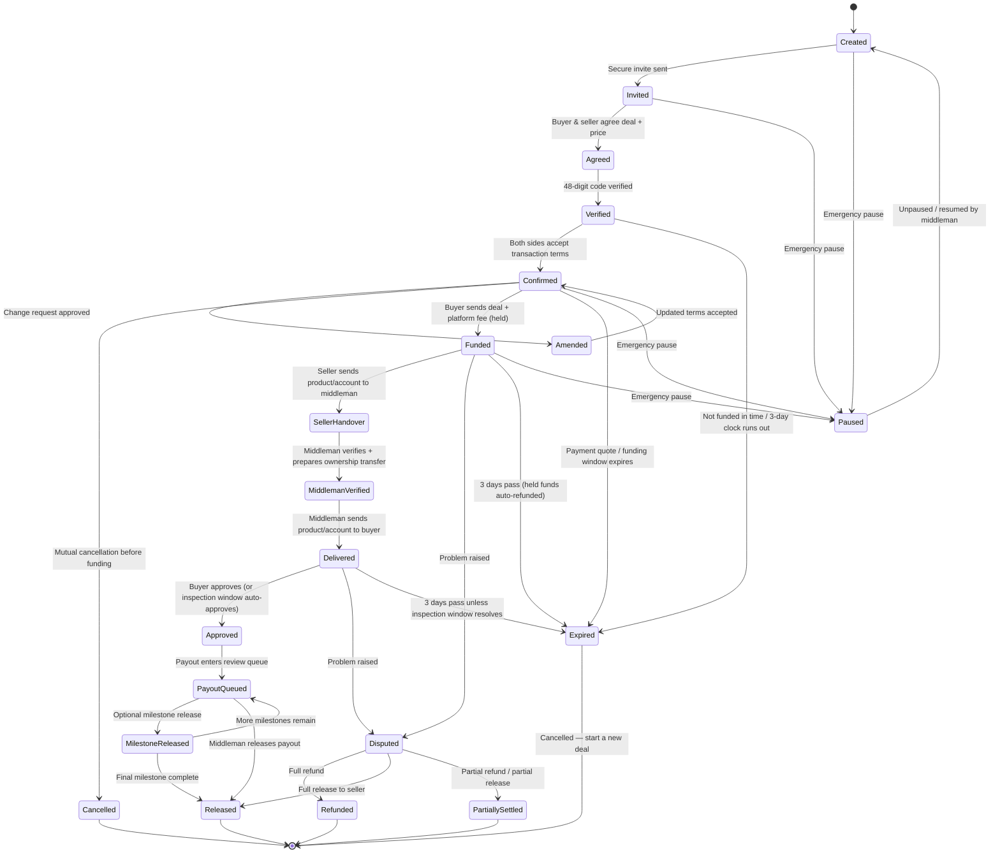
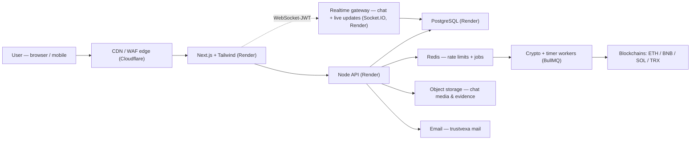

# TrustVexa — Escrow Website Project Plan

<aside>
🔒

**Private tool for real, local / group usage** — not a demo and not a test. The personal info you enter at sign-up is **encrypted**, **never shown to other users**, and **never leaked** — only the neutral **middleman** can see it to run a deal. **Passwords are never readable by anyone** (hashed). **No KYC documents** required.

</aside>

<aside>
🧭

**How this plan is organized:** the document is grouped into **Parts** for easy reading, with a clickable table of contents below. **Section numbers (§0–§35) are kept stable** so every internal "see §…" reference stays accurate — and **nothing has been removed**.

</aside>

---

# Part 0 — How we work & confirmed decisions

## 0. How we work on this plan

<aside>
🤝

**This is our shared plan and you drive it.** You tell me what you want — I record it exactly, then re-arrange the whole plan in clean order and verify there are no mismatches. Everything is built around your decisions; I will not add or change requirements on my own.

</aside>

### ✅ Decisions confirmed by you

**Purpose & usage**

- This is for **actual local / group usage** — **not a demo and not a test**.
- **Private and secure:** the info you enter is **encrypted**, **never shown to other users**, and **never leaked**.

**Hosting & look**

- **Everything hosted on Render** — no Vercel, no Supabase, no other platform (app, database, and services all on Render).
- Website must look **professional, SaaS-level**.
- **Use clear, professional, high-quality wording in every field, label, button, and message.**
- **Custom email built from trustvexa** (e.g. [name@trustvexa.com](mailto:name@trustvexa.com)).

**Company & About page**

- TrustVexa is presented as a professional company **built for the private, secure transfer of money and goods**.
- **USA headquarters** with a US business address shown on the About / Contact / footer — placeholder address **1007 N Orange St, 4th Floor, Wilmington, DE 19801, USA** (replace with the real registered address before handling real money).
- An **"About the developer"** section introduces who built it and the mission behind it.

**Roles**

- Each user can act as **both buyer and seller**.
- **Open signup:** anyone can create an account themselves — **no middleman invite is needed to join the platform**.
- **Deal invites come from the seller:** to start a private deal the **seller sends the one-time invite link** (hashed token), and the two sides verify each other with the generated code.
- **One middleman account** oversees every deal — a **single unique middleman username + password** (for now, that's only you).

**Access & how people connect** *(corrected)*

- **Free and open to everyone:** signing up and using the platform is **free**, and **anyone can use it** — it is **not invite-only / not exclusive**. (The only charge is the normal escrow **platform + network fee on an actual transaction**, per §7.)
- **Buyer & seller connect easily:** the two people who want to trade connect on the platform themselves — one starts a deal and shares the secure deal link with the other, who joins, and they verify each other with the 48-digit code. Connecting should be **simple and smooth**.
- **Middleman comes in only when needed:** the middleman stays out while buyer and seller talk and **agree the terms** — they step in **only once both sides are ready** and the **money / transaction** part needs handling.
- Privacy and security still protect each user's personal info and each private deal.

**Auth**

- **No 2FA** — email + password and **Google login** only.
- **Google login via GCP** — you will provide the GCP OAuth credentials.
- **JWT for verification & sessions:** every logged-in request and action is verified with a **signed JWT** — a short-lived access token plus a rotating refresh token. Email-verification, password-reset, recovery-email, and high-risk step-up links are signed, single-use tokens too. See §17.

**Live updates (real-time)**

- **WebSockets everywhere live data changes:** chat, presence / typing, deal status, payment & confirmation progress, payout / refund status, notifications, unread badges, live SLA countdowns, dispute threads, and the middleman dashboard all update **live** over a **JWT-authenticated WebSocket**, with automatic reconnect and a polling fallback. See §14.

**Integrations you will provide**

- **Mail access** from an external provider (you give the credentials) for trustvexa email.
- **GCP OAuth** credentials for direct Google login.
- **Operator receiving / escrow payout address(es)** — your crypto address(es) for receiving funds, provided later.
- *(You'll provide all of the above after some time.)*

**Process & contact flow**

- Buyer and seller first **agree on the deal and the price** themselves (they can chat directly).
- They then **verify each other** with the 48-digit code.
- The **middleman is contacted only once both are ready** on the deal and price.
- For the **transfer and the transaction, the middleman must be involved/contacted**.

**Messaging**

- Every message is **encrypted, P2P, and private**.
- **Screenshot blocking is ON by default for everyone**, except the **middleman**.
- **Media sharing is ON by default** — users can share **pictures and short video clips** in chat.
- **Links open in a new page/tab** (safely), never navigating away from the chat.
- **Chat history** available.
- Buyer and seller can **chat directly with each other before contacting the middleman**.
- **Delete chat / delete message** option for buyer and seller (in the buyer↔middleman and seller↔middleman chats):
    - Deleting removes it from the **buyer/seller side**.
    - The **middleman still sees it** — only **tagged "deleted"**, never removed from his view.
- **"Deal done → close this chat"** option, with a **reopen** option if something needs updating.

**Verification (buyer ↔ seller)**

- Buyer generates a **48-digit code with an expiry date**.
- Seller enters the code so the two **verify each other**.

**Reviews & ratings**

- After a deal, each side can leave a **star rating (1–5)** and a **written review** of the other party.
- Ratings feed into the user's **trust level / reputation**.

**Privacy & personal info**

- Personal info is collected **only at first sign-up** (email + the other info on the form). It is **stored encrypted**.
- **Only the middleman can see it** (encrypted in transit and at rest); **one user can never see another user's info**.
- **Passwords are never stored in readable form** (hashed) and are **never visible to anyone**, including the middleman.
- **No KYC documents** required.

**Middleman dashboard**

- One screen shows **both the buyer and the seller together**.
- The middleman is **exempt from screenshot blocking**.
- The middleman **can see each user's personal info** (the email + details entered at sign-up) — **encrypted, with the password never shown**.

**Fee structure**

- **Platform fee = one single total fee** on a sliding scale by deal size (5% → 1.35%), **min $30**, **paid by the buyer, the seller, or split** — not charged per side.
- **Seller also pays a flat 0.5% settlement fee + the real network/gas fee** out of their payout, on every deal.
- **Buyer sends = Deal amount + Platform fee** (when the buyer covers the fee; lower if split or seller-paid).
- **Seller receives = Deal amount − (any seller-paid Platform fee) − 0.5% settlement fee − Transaction (gas) fee.**

**Timing (SLA)**

- **Middleman reply:** usually within **24 hours**.
- **Seller payout:** usually within **1 hour**, sometimes up to **24 hours**; in abnormal/disputed cases up to **7 days**.
- **3-day completion deadline:** once the **middleman is contacted**, the transaction must be **completed within 3 days**. If it isn't, the deal is **cancelled and must start over as a brand-new deal**, and the **responsible user's trust level is lowered** (the "downgrade"). This countdown **runs automatically in the background**. *(An open dispute pauses the clock.)*

**Trust level (reputation) — thresholds**

- Every user **starts in good standing**; honest users essentially **never hit a limit** — normal use (even a rare accidental slip) stays unrestricted.
- **1st missed 3-day deadline →** friendly **warning only** (no restriction).
- **2nd miss →** soft limit: **one active deal at a time** + a short cooldown.
- **3rd miss →** **temporary block on creating new deals** (about 7 days).
- **4th miss / clear fraud →** **blocked** from new deals until the middleman reviews and reinstates.
- **Trust recovers** with successfully completed deals over time.
- **Bots / abusers are handled separately:** abuse signals (flooding sign-up / login / code attempts, rapid mass deal creation, anything flagged in `abuse_flags`) trigger an **immediate block pending review** — they skip the gentle graduated path, and genuine users don't trip these.

**Abuse protection & rate limiting**

- **Rate limits everywhere** — sign-up, login, password reset, code attempts, deal creation, payments, messaging, and uploads — so **no bot or user can abuse the platform**.
- **Bot and botnet / DDoS protection** at the network edge plus app-level limits.

**Payments — crypto only**

- Supported coins: **USDT, SOL, BNB, ETH, TRX**.
- **USDT networks:** **TRC-20 (Tron), ERC-20 (Ethereum), BEP-20 (BNB), and Solana (SPL)** — i.e. on every chain we already support.
- **Deal size: minimum $400, maximum $50,000** per deal.
- **Simple payment first:** build the easiest payment flow first — buyer chooses coin/network, the site shows the escrow address + QR + exact amount, buyer sends from their own wallet, pastes the tx hash / screenshot, and the middleman verifies it on-chain before marking the deal funded.
- **Connect-wallet + automatic on-chain payment detection (confirmed — included):** build automatic on-chain detection (and optional connect-wallet) so a deal funds itself once payment lands — **and if that can't be done safely for a coin/network, fall back to the manual direct-send + tx-hash verification.** Manual verification is always the guaranteed fallback. *(Operator receiving address to be provided later.)*
- **Every wallet and transaction is highly secure and encrypted — no one can see it** (addresses and transaction details are encrypted at rest and never exposed to other users).
- **Fees / charges (final):** platform fee is **one total fee** on a sliding scale (5% → 1.35% by deal size, min $30), payable by buyer / seller / split; the seller also pays a flat **0.5% settlement fee + real gas**. See §7.
- Every transfer must be **done securely**.

**Crypto key custody (confirmed)**

- The escrow wallet keys are held by a **single trusted operator — you, the middleman** — so there is **one accountable, trusted holder** and no outside party can interfere (keeps fraud risk down).
- **Key generation:** the keys / seed phrase are **generated offline** on a secure device.
- **Backup:** the **seed phrase is backed up offline** (written / metal backup in safe storage) — **never** stored in the app, database, or cloud in readable form.
- **Signing a payout:** releases are **signed by the trusted holder** with a **2-step confirmation**; the app never holds raw keys for automatic spending.
- **Hot / cold split:** only active-deal funds sit in a **hot wallet**; reserves stay in **cold storage**.
- **Multi-signature** can be added later if more trusted middlemen join.

**Buyer payment & refund wallet (confirmed)**

- **MVP payment method:** buyer **pays directly** to the displayed escrow address from any wallet. The payment page shows the **coin, network, exact amount, QR code, copy button, and warning**.
- Buyer then pastes the **transaction hash** and can upload a payment screenshot if needed; the middleman verifies the transaction before funding the deal.
- **Connect-wallet + automatic on-chain detection are attempted in the build**; where they aren't feasible/safe, the manual direct-send + tx-hash verification stays as the fallback.
- A **refund wallet is captured** so that on expiry / dispute the crypto returns **straight to the buyer**.
- **Every wallet and transaction is encrypted and hidden** — no user can ever see another person's address or transaction.

**Upload limits (confirmed defaults)**

- **Images:** up to **10 MB** each (jpg / png / webp / gif).
- **Short video clips:** up to **60 seconds** and **50 MB** (mp4 / webm / mov).
- **Dispute-evidence files:** up to **25 MB** (pdf / image).
- **Up to 5 attachments per message.**
- Every upload is **type-, size-, and duration-checked and malware-scanned on the server** (the client is never trusted), and uploads are **rate-limited**.

**Data retention & account deletion (confirmed)**

- **Financial / escrow audit logs are kept permanently** (immutable record of money movements).
- **Chats and media** are kept while the account is **active** and for a **short period after a deal closes**, then cleaned up.
- **"Delete my account"** **erases or anonymises** your personal info (email + sign-up details), keeping **only the minimum** tied to past deals needed for the audit trail; **passwords are already unreadable** (hashed).

**About / company details (confirmed)**

- The **About** and **About-the-developer** sections show: **Ethan R. Caldwell — Founder & Lead Developer** (mission: private, secure transfer of money and goods) and **Jonathan M. Pierce — US Operations Lead** as the US contact point.
- **Legal entity line (public):** "TrustVexa is operated by a privately held, **multi-investor-funded company**. For privacy and security reasons, full corporate registration details are **not publicly disclosed**."
- **USA headquarters street address (placeholder set):** **1007 N Orange St, 4th Floor, Wilmington, DE 19801, USA** is used for now on the About / Contact / footer. *Honest note: this is a placeholder — a real, registered US business address must replace it before the platform handles real money.*

**Edge cases & safeguards (confirmed)**

- Full **problem → solution** detail lives in **§22**. Confirmed to build: **wrong-amount / wrong-network deposit handling**, **exchange-rate lock at funding**, **inspection-window auto-approve**, **pre-funding expiry**, a **custody backup / recovery plan** (path to multi-sig), **wallet screening**, **account recovery flow**, **middleman action audit + dual control on big payouts**, **terms-acceptance logging**, **saved wallet address book**, **PDF receipts**, **active sessions / "log out everywhere"**, **deal timeline view**, **idempotent blockchain crediting**, **balance reconciliation**, **fallback RPC + low-balance alerts**, and an **operator withdrawal allowlist with time-delay**.

**Final missing / improvement features (confirmed)**

- Full final-plan detail lives in **§23**. Confirmed to add: **secure expiring invite links**, **final deal confirmation screen**, **QR code + strong network warning**, **per-chain confirmation rules**, **payment quote expiry**, **partial refund / partial release**, **dispute playbook + evidence checklist**, **emergency pause / circuit breaker**, **payout queue**, **new-device login alerts**, **anti-phishing protections**, **user report / block**, **private admin notes**, **status page + incident banner**, **user data export**, **delivery checklist per deal type**, **prohibited-item check during deal creation**, **transaction explorer links**, **internal support / ticket system**, and a **launch checklist / go-live gate**.

**Middleman enforcement & assisted handover (confirmed)**

- The **middleman can block users**, remove access, and **permanently delete / erase users or chats from the active app** when needed for abuse, fraud, spam, or privacy cleanup. *Financial / escrow audit logs still keep the minimum required record so money movement cannot be secretly erased.*
- The main handover flow is **middleman-controlled**: seller sends the product / account to the middleman, buyer sends the money, the middleman verifies and changes/transfers the product/account ownership to the buyer, then sends the product/account to the buyer and releases money to the seller.

**General platform features (confirmed — excluding MVP/later split)**

- Full detail lives in **§24**. Confirmed to add: **transaction terms / agreement record**, **change request / amendment system**, **mutual cancellation before funding**, **milestones / split delivery option**, **transaction history page**, **deal templates**, **risk score / risk flags**, **admin decision reason required**, **admin override with warning**, **guided help / knowledge-base flow**, **new-user onboarding checklist**, **trust badges / account labels**, **user warning notices before restrictions**, **email deliverability setup**, **failed notification log**, **deal-level legal acceptance**, **refund fee rules**, **wallet address change lock**, and **device/IP risk review for money actions**.

**Operational platform features (confirmed — excluding your skipped items)**

- Full detail lives in **§25**. Added everything from the latest missing-feature review **except** the single deferred item: **saved counterparty / trusted contacts**. Confirmed to add: **trust / verification-level badge (no full KYC — surfaces `trust_level` + `account_label`, reuses the existing trust-badge system)**, **repeat / duplicate-deal button (clones a past deal's settings only — never the other party's name or personal data)**, **admin search / filters / bulk actions**, **user deal activity timeline**, **admin audit timeline**, **locked dispute evidence**, **dispute conversation thread**, **counterparty safety preview**, **deal limit controls**, **manual hold / review hold**, **document center**, **deal agreement PDF**, **final dispute decision PDF**, **SLA countdown UI**, **deadline reminders**, **notification inbox archive**, **admin analytics**, **fraud analytics**, **error codes / support request IDs**, **upload quarantine**, **read receipts for important events**, **user inactivity handling**, **secret reveal control**, and **secure credentials vault for handover**.

**Final user safety & clarity features (confirmed)**

- Full detail lives in **§26**. Confirmed to add: **wallet address validation**, **payment status progress tracker**, **user security log**, **email change flow**, **password change flow**, **deal-hold explanation page**, **refund status tracker**, **buyer handover acceptance checklist**, **seller handover proof checklist**, **before-you-pay safety screen**, **public/private display-name rules**, **user-side account deletion flow**, **safe file preview**, **user-friendly empty states / next actions**, and **support SLA visibility**.

**Common platform essentials (confirmed)**

- Full detail lives in **§27**. Confirmed to add: **user profile page**, **account settings hub**, **local timezone + localized date/time**, **language / multi-language support**, **theme toggle (dark/light)**, **"action required" center**, **admin announcement / broadcast**, **changelog / what's-new**, **platform feedback / rating**, **session timeout warning + remember me**, **mobile-installable (PWA)**, **public contact form + cookie consent banner**, **SEO / metadata**, **backup / break-glass admin access**, and **suspicious-activity / AML monitoring**.

**More common platform features (confirmed)**

- Full detail lives in **§28**. Confirmed to add: **typing indicator + online/last-seen presence** (buyer↔seller see each other; with the middleman, only the middleman sees the user's status and the middleman's own status stays hidden), **in-chat message search**, **pin / star messages & deals**, **password strength + breached-password check**, **account lockout after failed logins**, **CAPTCHA / bot challenge**, **age (18+) confirmation**, **live fiat-equivalent display**, **deal tags + private notes**, **calendar export (.ics)**, **global user search**, **searchable help / FAQ**, **notification quiet hours + email digest**, **unsubscribe / email-preference link**, **friendly error & maintenance pages**, **per-deal experience rating (CSAT)**, **terms re-acceptance on change**, **stronger invite expiry / revoke / single-use**, and an optional **referral / invite-tracking program**.

**Extra everyday features (confirmed)**

- Full detail lives in **§29**. Confirmed to add: **profile photo / avatar**, **message reactions**, **reply / quote a message**, **edit a sent message** (original text kept in a middleman-visible history), **@mentions in chat**, **voice messages**, **chat draft autosave**, **temporary account deactivation (pause & reactivate)**, and a **recovery backup email**. *(Already-present items like email verification, dark mode, multi-language, accessibility, malware scanning, timezone, status page, deliverability, new-device alerts, notification inbox, PDF receipts, and device/session management were not duplicated.)*

**Advanced & missing platform features (confirmed)**

- Full detail lives in **§30**. Confirmed to add: **per-message delivery & read status (sent / delivered / seen)**, **mute / archive a conversation**, **forward & copy a message**, **basic message formatting**, **web / mobile push notifications**, **per-conversation unread badges**, a **PII access audit log** (every middleman view of personal info is logged), **security headers / CSP**, a **data-breach notification & incident-response policy**, **multi-fiat display**, **price-feed redundancy + stale-price guard**, **chain-reorg handling**, and **save deal as draft**. Read status follows the same presence-privacy rule — the middleman's own status stays hidden.

**Resilience, security & trust improvements (confirmed)**

- Full detail lives in **§31**. Confirmed to add: **stuck-transaction handling (fee-bump / retry)**, **address-poisoning protection**, **operator daily payout cap**, **auto cold-storage sweep**, **slippage / price-tolerance band**, **tamper-evident hash-chained audit logs**, **dispute-evidence file hashing**, **email step-up confirmation for high-risk money actions**, **responsible disclosure + security.txt**, **practice / testnet trial deal**, **middleman availability / business hours**, and a **visible data-retention countdown**.

**Financial operations, infrastructure & hardening improvements (confirmed)**

- Full detail lives in **§32**. Confirmed to add: **double-entry escrow ledger**, **official token contract allowlist**, **crypto decimal / rounding safety**, **payout/refund preflight check**, **gas reserve + gas top-up workflow**, **encryption key rotation / key versioning**, **object/media backup and restore**, **RPO/RTO disaster-recovery targets**, **dead-letter queue for failed background jobs**, **legal hold / evidence-preservation mode**, **appeal / unblock request flow**, **anti-impersonation reserved names**, **domain/DNS hardening**, **automated secret scanning before deploy**, and **admin setting-change audit + cooldown**.

**Operations, integrity & trust controls (confirmed)**

- Full detail lives in **§33**. Confirmed to add: **operator-only finance / treasury reconciliation dashboard** (private to the operator, never shown to clients), **concurrency control / optimistic locking on deal state & balances**, **API-level idempotency keys for money actions**, **collusion / self-dealing detection** (internal-only), **governing-law / arbitration / liability clause in Terms**, **stablecoin depeg / price-source sanity guard**, **feature flags + per-feature kill switch**, and an **operator / staff role & granular-permission model** (future-ready; internal only). *(Excluded by you: country / jurisdiction sanctions blocking, and the "improve" set — DSAR workflow, public review replies, incident-status subscription, and external log anchoring.)*

### 📝 To decide / pending

- **Platform fee / transaction-fee numbers** *(decided — final)* — **platform fee = ONE single total fee on a sliding scale by deal size** (not charged per side): $400–$1,500 = **5%**, $1,500–$3,000 = **3.5%**, $3,000–$5,000 = **3%**, $5,000–$7,500 = **2.5%**, $7,500–$12,000 = **2%**, $12,000–$20,000 = **1.75%**, $20,000–$50,000 = **1.35%**, with a **$30 minimum**. The platform fee can be **paid by the buyer, the seller, or split 50/50** — their choice per deal. On top, the **seller always pays a flat 0.5% settlement fee + the real network/gas cost** out of their payout. **Transaction fee = real network/gas**, live pass-through by coin/network at 2026 rates (Solana ~$0.001 · BEP-20 ~$0.05–0.30 · TRC-20 ~$0.50–1.50 · ERC-20 ~$2–10) — roughly ~0.0001%–0.15% of the deal on the recommended chains. See §7.
- **Review visibility** *(decided)* — ratings & reviews are **public to everyone**, but show **only the reviewer's username** — never email or any other personal details.
- **About exact values** *(decided)* — public **founder / developer persona**: **Ethan R. Caldwell — Founder & Lead Developer**, with **Jonathan M. Pierce — US Operations Lead** as the US-based contact. **USA headquarters street address (placeholder):** **1007 N Orange St, 4th Floor, Wilmington, DE 19801, USA** — used for now, but a real, registered US address must replace it before go-live (cannot be invented for a money service).
- **Legal entity** *(decided)* — present TrustVexa as a **privately held, multi-investor / investor-funded company**; **full corporate registration is intentionally not publicly disclosed for privacy and security reasons**. *Honest note: even when not shown publicly, a real money service must still hold truthful, verifiable entity + funding details on file.*

<aside>
⚠️

**Honest note on screenshot blocking:** on a normal website/phone this is **best-effort** — the operating system can always take a screenshot. We apply strong deterrents by default (viewer-ID watermark, disabled copy/print, blur on focus-loss) for everyone except the middleman, but it cannot be a 100% hard block on the web.

</aside>

# Part I — Product overview & how a deal works

*The product, who's involved, and the full life of a deal — from invite to release.*

## 1. What the project is

An escrow platform where a **buyer** and **seller** trade safely through a neutral **middleman** (you / the platform):

- Buyer and seller agree a deal → buyer's crypto is **held** → seller delivers → buyer approves → funds are **released** to the seller.
- Covers **digital products** and **account sales** (the legal, non-prohibited kind).
- **Free and open** — the platform is free and anyone can use it; buyer and seller connect easily on it, and each individual deal stays private between the two people trading.
- Payments are **crypto only** — USDT, SOL, BNB, ETH, TRX (real transfers on mainnet, held in escrow until release).

## 2. Roles

- **Buyer / Seller** — anyone can **freely register** (no invite needed to join); any registered user can be either buyer or seller, and one person can buy on one deal and sell on another.
- **Middleman (admin)** — a **single neutral operator account** (one unique username + password; for now, you) who holds the funds, receives / verifies the product or account handover, can transfer ownership details to the buyer, sees both sides (and each user's encrypted personal info), resolves disputes, blocks or deletes abusive users/chats when needed, and releases payouts.

## 3. How a deal works (end-to-end)

1. **Open signup, then seller invite** — Anyone can register an account freely (no middleman invite needed to join). To start a deal, the **seller creates it and sends an expiring, one-time invite link** (hashed token); the invite shows exactly who is joining which deal, and it can be revoked.
2. **Prohibited-item check** — During deal creation, the user confirms the item is legal and allowed; risky keywords or suspicious deal types go to middleman review before funding.
3. **Discuss** — Buyer and seller chat directly and **agree the deal and price**.
4. **Verify** — Buyer generates a **48-digit code (with expiry)**; seller enters it so both sides are verified.
5. **Transaction terms & final confirmation** — Before any money moves, both sides see and accept a locked deal agreement: buyer, seller, product/account details, amount, coin/network, fees, seller payout, refund wallet, inspection window, 3-day deadline, delivery rules, refund/release rules, and deal-level legal checkboxes.
6. **Change / cancel rules before funding** — If price, product, wallet, deadline, or delivery terms change, it becomes a **change request** that both parties approve and the middleman approves when money/product is affected. Before funding, either side can request **mutual cancellation** with no penalty if both agree.
7. **Bring in the middleman** — Once both are ready on deal + price, the **middleman is contacted** to handle the money.
8. **Fund (held) — simple payment** — The buyer deposits the **agreed funding amount** (deal amount, plus the platform fee if the buyer is the one paying it — buyer, seller, or split is set on the deal) directly from their own wallet to the displayed escrow address. The page shows the coin/network, exact amount, QR code, copy button, and strong network warning. Buyer pastes the tx hash / screenshot, and the middleman verifies it on-chain before marking the deal funded. The payment quote expires unless refreshed; once paid and confirmed, the **USD↔coin rate is locked at funding** (see §22 and §23).
9. **Seller hands product to middleman** — Seller sends the product / account details to the **middleman first**, not directly to the buyer, and completes the deal-type checklist.
10. **Middleman verifies / prepares transfer** — Middleman checks the product/account, confirms access, and if needed changes ownership / recovery details so the buyer becomes the owner.
11. **Buyer receives product/account** — After the buyer's money is funded and the middleman verifies the handover, the middleman sends the product / account to the buyer.
12. **Approve / dispute / auto-approve** — Buyer inspects and approves. If the buyer goes silent, an **inspection window** auto-approves so an honest seller still gets paid (see §22). If there is a problem, the buyer opens a dispute with required evidence.
13. **Payout queue & release** — Approved payouts enter a **pending payout queue**; the middleman reviews final details, then sends money to the seller. Large releases require the extra hold / confirmation rule.
14. **Partial settlement if needed** — In disputes, the middleman can choose full refund, full release, or **partial refund / partial release**, with the reason logged.
15. **Milestone option for complex deals** — Normal deals stay one-shot, but high-value or multi-step account transfers can use milestones / split delivery where each stage is approved separately.
16. **Review** — Both sides can leave a **rating and review** of each other.
17. **History, close / reopen / admin delete** — The deal appears in transaction history; the chat can be marked **"Deal done → close"**, reopened if something needs updating, or permanently deleted from the active app by the middleman when required.

<aside>
⏱️

**Timing:** middleman replies usually within **24 hours**; seller payout usually within **1 hour** (sometimes up to **24 hours**, and up to **7 days** in abnormal/disputed cases).

</aside>

<aside>
⏳

**3-day completion rule:** once the **middleman is contacted** (step 7), the deal must reach **Released within 3 days**. A **background timer** tracks this automatically — if the 3 days run out, the deal is **cancelled / downgraded**, any held funds are **refunded to the buyer**, the two sides must **start a brand-new deal**, and the **responsible user's trust level drops**. *(An open dispute pauses the timer.)*

</aside>

## 4. Escrow state machine

- Money never moves outside these states. Every transition is logged in `escrow_logs`.
- **3-day completion clock:** from the moment the middleman is contacted, the deal must reach **Released within 3 days**. A **background timer** enforces this — if it runs out, the deal moves to **Expired** (any held funds are auto-refunded to the buyer), the deal is cancelled, the **responsible user's trust level is lowered**, and the two sides must **start a new deal**. An open dispute pauses the clock.
- **Secure invite:** invite links are **one-time, expiring, and revocable** so private deals cannot be joined through leaked links.
- **Final confirmation / terms:** before funding, both sides accept the locked deal terms so there is a clear audit record of what was agreed.
- **Change/cancel before funding:** amendments require both sides' approval, and cancellation is clean before funds move. Funded deals go through refund/dispute flow.
- **Middleman-assisted handover:** seller hands the product/account to the middleman first; the middleman verifies it, prepares the ownership transfer to the buyer, then gives the buyer access before seller payout.
- **Pre-funding expiry:** if the buyer never sends valid funds within the funding window, the deal **auto-expires and cancels** (no penalty if nothing was paid). See §22.
- **Inspection auto-approve:** after **Delivered**, if the buyer doesn't approve or dispute within the **inspection window**, the deal **auto-releases** to the seller. See §22.
- **Emergency pause:** the middleman can temporarily pause new deals, deposits, payouts, withdrawals, or signups during a hack, wallet issue, RPC failure, or legal/security incident. See §23.

## 5. Verification (48-digit code)

- Buyer generates a **48-digit code with an expiry date**.
- Seller enters it to **verify each other** before the deal proceeds.
- The code is **stored hashed** (never in plain text), **single-use**, and every attempt is **rate-limited** and logged; expired or wrong codes are rejected.
- **Token verification (JWT):** separate from this buyer ↔ seller code, the platform verifies **every authenticated request, action, and WebSocket connection with a signed JWT** (see §17). **Email-verification, password-reset, recovery-email, and step-up links are signed, single-use, short-expiry tokens** so they cannot be forged or replayed.

# Part II — Communication, fees & payments

*How people talk, what a deal costs, and how crypto moves safely through escrow.*

## 6. Messaging & chat

- **Real-time over WebSockets:** chat runs on a **JWT-authenticated WebSocket** ([Socket.IO](http://Socket.IO)) so messages, typing, presence, read receipts, and delivery status appear **live**. If the socket drops, the client **auto-reconnects (re-presenting its JWT)** and falls back to polling so nothing is missed. A user's socket only joins the rooms for their own deals.
- **Encrypted, P2P, private**; full **chat history** kept.
- Three chat lanes: **buyer ↔ seller** (direct, before the middleman), **buyer ↔ middleman**, **seller ↔ middleman**.
- **Presence & typing indicators:** in the **buyer ↔ seller** chat, both sides see each other's **online / last-seen status and typing indicator**. In the **buyer ↔ middleman** and **seller ↔ middleman** chats, **only the middleman** sees the user's online / last-seen / typing status — the **middleman's own presence is never shown** to the buyer or seller: they can **never see whether the middleman is online, the middleman's last-seen time, or whether the middleman is typing or watching** the chat.
- **In-chat message search:** users can search messages inside a conversation to find an old message fast.
- **Pin / star:** users can pin or star important messages, and pin a deal, for quick access.
- **Message reactions:** react to any message with an emoji (👍 ✅ ❌ etc.).
- **Reply / quote:** reply to a specific earlier message so the context stays clear in a busy chat.
- **Edit a sent message:** senders can edit their own messages (shown as "edited"); the **original text is kept in an edit history the middleman can see**, so a deal message can never be silently changed.
- **@mentions:** tag a specific person in a chat to get their attention.
- **Voice messages:** record and send short audio notes, with the same size / duration limits and malware-safe handling as other media.
- **Draft autosave:** half-written chat messages are auto-saved per conversation, so nothing is lost on refresh or disconnect.
- **Delivery & read status:** every message shows **sent → delivered → seen** states. Read status follows the presence rule — buyer ↔ seller see each other's read status, while in chats with the middleman only the middleman sees the user's read status and the **middleman's own status stays hidden**.
- **Mute / archive a conversation:** users can mute a chat's alerts or archive a finished conversation without deleting anything.
- **Forward / copy a message:** users can copy message text or forward a message into another of their own deal chats (forwarded messages are marked as forwarded and stay within the user's allowed chats).
- **Message formatting:** basic **bold**, *italic*, lists, and inline code / links are supported, with safe rendering (no script injection).
- **Unread badges:** per-conversation unread counts plus a total unread badge show where a reply is waiting.
- **Attachments (default on):** users can share **images and short video clips** directly in chat. **Limits:** images up to **10 MB**, video clips up to **60 s / 50 MB**, evidence files up to **25 MB**, **max 5 per message**. Files go to **object storage**, are **type-, size-, and duration-checked and malware-scanned on the server** (the client is never trusted), encrypted, covered by the same screenshot deterrents, and **rate-limited**.
- **Link handling:** links are detected and **open in a new browser tab** (`target="_blank"` + `rel="noopener noreferrer"`), with an optional safety confirmation — they never navigate the user away from the chat.
- **Screenshot blocking ON by default** for everyone except the **middleman** (best-effort on web): viewer-ID watermark, disabled right-click/copy/print, blur on focus-loss.
- **Delete message / chat** on the buyer or seller side → removed from their view (including attachments), but the **middleman still sees it tagged "deleted"**.
- **"Deal done → close chat"**, with **reopen** when an update is needed.

## 7. Fee structure

- **Platform fee is ONE single total fee** for the whole deal — **not charged per side** — and can be **paid by the buyer, the seller, or split 50/50** (their choice per deal).
- **Buyer sends:** `Deal amount + Platform fee` (when the buyer covers the fee; less if split or seller-paid)
- **Seller receives:** `Deal amount − (any seller-paid Platform fee) − 0.5% settlement fee − Transaction (gas) fee`
- The middleman holds the full amount and settles fees at payout.
- **Fee type (confirmed):** the **platform fee is a single total percentage of the deal amount on a sliding scale** (bigger deal → lower %), charged in the **same coin** as the deal. On top, the **seller always pays a flat 0.5% settlement fee + the real network/gas cost** out of their payout. The **gas cost** is a **live pass-through estimate**, never marked up. All amounts show in the deal's coin with a **USD estimate**.

**Platform fee — one total fee, sliding scale (confirmed):**

| Deal amount (USD) | Platform fee (one total fee) |
| --- | --- |
| $400 – $1,500 | **5%** |
| $1,500 – $3,000 | **3.5%** |
| $3,000 – $5,000 | **3%** |
| $5,000 – $7,500 | **2.5%** |
| $7,500 – $12,000 | **2%** |
| $12,000 – $20,000 | **1.75%** |
| $20,000 – $50,000 (max deal) | **1.35%** |

*On a boundary amount the lower % applies (e.g. exactly $3,000 → 3%, exactly $5,000 → 2.5%). Deal size runs from $400 up to the $50,000 max.*

**Minimum platform fee: $30** — if the % works out below $30, a flat $30 applies instead. The platform fee is **one total fee for the whole deal** (not charged per side) and can be **paid by the buyer, the seller, or split** however the two sides agree.

**Seller settlement fee: 0.5% + real gas** — separately, on **every** deal the seller's payout has a flat **0.5% settlement fee** plus the **real network/gas cost** deducted, no matter who pays the platform fee above.

**Transaction (network / gas) fee — real cost by coin/network (live estimate, pass-through — 2026 rates):**

| Coin / network | Typical real gas (2026) | As % of deal (low–mid) |
| --- | --- | --- |
| SOL / USDT — Solana (SPL) | ~$0.001 or less | ~0.0001% |
| BNB / USDT — BEP-20 (BSC) | ~$0.05 – $0.30 | ~0.005% – 0.03% |
| TRX / USDT — TRC-20 (Tron) | ~$0.50 – $1.50 | ~0.05% – 0.15% |
| ETH / USDT — ERC-20 (Ethereum) | ~$2 – $10 | ~0.2% – 1% |

*Gas is read live at payout time (plus a small buffer so payouts don't fail) — never marked up. On the recommended chains (Solana, BEP-20, TRC-20) gas stays around ~0.0001% – 0.15% of the deal — a fraction of a cent up to ~$1.50. The fixed $ cost shrinks as a % on bigger deals, and the deal-screen calculator shows it in both $ and %.*

**Buyer / seller summary:**

| Item | Amount |
| --- | --- |
| Platform fee | One total fee on the sliding scale above (5% → 1.35% by deal size), minimum $30, paid by buyer / seller / split |
| Seller settlement fee | Flat 0.5% of the deal + real gas, always taken from the seller's payout |
| Transaction (network) fee | Real gas, live by coin/network |
| **Buyer sends** | **Deal amount + Platform fee** (if buyer-paid; less if split / seller-paid) |
| **Seller receives** | **Deal amount − (any seller-paid Platform fee) − 0.5% settlement − Transaction (gas) fee** |

**Worked examples** *(platform fee shown as buyer-paid here; the 0.5% seller settlement fee and gas are taken from the seller's payout. Gas shown separately. A $30 minimum platform fee applies on the smallest deals.):*

| Deal (USD) | Platform fee (one total) |   • 0.5% seller fee | Total platform take | Buyer sends | Seller receives (before gas) |
| --- | --- | --- | --- | --- | --- |
| $400 | $30 (min) | $2.00 | **$32.00** | $432 | $398.00 |
| $1,000 | $50 (5%) | $5 | **$55** | $1,050 | $995 |
| $2,500 | $87.50 (3.5%) | $12.50 | **$100** | $2,587.50 | $2,487.50 |
| $10,000 | $200 (2%) | $50 | **$250** | $10,200 | $9,950 |
| $50,000 | $675 (1.35%) | $250 | **$925** | $50,675 | $49,750 |

A live **fee calculator** on the deal screen shows both sides exactly how much the buyer sends and how much the seller receives after the platform fee and the transaction (gas) fee → [Fee Calculator — Buyer & Seller](TrustVexa%20%E2%80%94%20Escrow%20Website%20Project%20Plan/Fee%20Calculator%20%E2%80%94%20Buyer%20&%20Seller%205ff83d1255124dbfbebdf6102fc9f670.md).

## 8. Payments & escrow wallet (crypto only)

- Coins: **USDT, SOL, BNB, ETH, TRX**. **USDT is supported on TRC-20 (Tron), ERC-20 (Ethereum), BEP-20 (BNB), and Solana (SPL)** — every chain we already support.
- Libraries: **ethers.js** (ETH / BNB), **Solana web3.js** (SOL), **TronWeb** (TRX / USDT-TRC20).
- **Per-deal deposit address:** each deal gets its **own escrow address**, so an incoming payment is matched to the right deal automatically.
- **Per-chain confirmations:** the deal only moves to **Funded** after enough on-chain confirmations — default rules: **ETH / ERC-20 = 12 confirmations**, **BNB / BEP-20 = 15 confirmations**, **Tron / TRC-20 = 20 confirmations**, and **Solana / SPL = finalized status**. Large or suspicious deals can require extra confirmations.
- **Manual payment (guaranteed fallback):** buyer pays by **direct transfer** from their own wallet to the displayed escrow address — this always works and is used wherever automatic detection isn't feasible.
- **Payment proof:** after sending, the buyer pastes the **tx hash** and may upload a screenshot; the middleman verifies the transaction on the blockchain explorer and then marks the deal **Funded**.
- **Wallet address validation:** before saving a payout/refund wallet or showing payment instructions, validate the address format against the selected coin/network and warn on mismatches.
- **Official token-contract validation:** for token payments like USDT, verify the incoming token contract/mint against the official allowlist for the selected network before crediting the deal.
- **Before-you-pay safety screen:** before the buyer sees the final payment address, they confirm coin/network, exact amount, refund wallet, wrong-network risk, official TrustVexa domain, and that TrustVexa never asks for seed phrases.
- **Payment screen safety:** show a **QR code**, copy button, checksum / shortened address preview, exact amount, and a big network warning like **"Send only USDT TRC-20 to this address."** The buyer must tick that wrong-network payments may not be recoverable.
- **Payment status tracker (live):** users see payment progress **update in real time over the WebSocket** — waiting for payment → tx hash submitted → middleman checking → confirmations pending → payment verified → deal funded — with the on-chain **confirmation count ticking up live** (polling fallback if the socket drops).
- **Payment quote expiry:** before funding, the displayed coin amount expires after a short window (for example 10–15 minutes). If it expires, the buyer refreshes the quote; once payment is confirmed, the funding rate is locked.
- **Connect-wallet + automatic on-chain detection (build target):** attempt automatic on-chain payment detection (and optional connect-wallet) so background watchers match and confirm each per-deal deposit without manual tx-hash entry; where it can't be done safely for a chain, fall back to the manual direct-send + tx-hash flow above.
- **Seller payout address:** the seller provides their **own wallet address**; the address is validated, encrypted, and locked by the wallet-change rules before payout.
- **Buyer refund address:** the buyer provides a **validated refund wallet address** (same coin / network) at funding, so an expired or disputed refund goes straight back to them.
- **Refund status tracker:** users see refund progress — refund requested/triggered → middleman review → refund approved → refund sent → confirmed on-chain → receipt available.
- **Wallets & transactions are encrypted and hidden:** every address and transaction detail is **encrypted at rest** and **never visible to other users**.
- **Key custody (confirmed):** keys are held by a **single trusted operator — you, the middleman**; the **seed phrase is generated and backed up offline**, payouts are **signed by the trusted holder with a 2-step confirmation**, and the app never stores raw spending keys. Multi-signature can be added later if more trusted middlemen join.
- **Min / max per deal:** **minimum $400, maximum $50,000**.
- **Hot / cold split:** keep only what's needed for active deals in a **hot wallet**; larger reserves sit in **cold storage**.
- **Network / gas fees** are handled by the platform and accounted for as the **Transaction fee**.
- **Payout queue:** approved seller payouts first enter **Pending payout**; the middleman reviews the final address, amount, coin/network, fees, and dispute status before broadcasting.
- **Release is middleman-only + 2-step:** the middleman confirms twice before any payout; every move is **confirmed on-chain and logged** before the status changes.
- **Double-entry escrow ledger:** every deposit, fee, refund, payout, gas cost, and adjustment is recorded as balanced debit/credit ledger entries, not only as payment rows or logs (see §32).
- **Official token contract allowlist:** token deposits are accepted only from the official supported token contracts for each chain/network; fake USDT or look-alike tokens are rejected (see §32).
- **Crypto decimal / rounding safety:** all crypto amounts are stored in smallest units / integer precision, never floating point; UI rounding is display-only (see §32).
- **Payout/refund preflight check:** before any payout/refund is signed, the system confirms deal status, dispute status, address, chain, amount, gas, payout cap, allowlist, and ledger balance (see §32).
- **Gas reserve + top-up workflow:** hot wallets must keep enough native gas coin per chain; low reserve blocks risky payouts and alerts the middleman to top up before failure (see §32).
- **Transaction explorer links:** every deposit, refund, and payout has a blockchain explorer link visible only to the relevant user and middleman.
- **Wrong-amount / wrong-network deposits** are detected and handled — top-up on underpayment, auto-refund of overpayment, manual recovery of misdirected coins (see §22).
- **Exchange rate is locked at funding** (USD↔coin) from a price source and stored on the deal (see §22).
- **Idempotent crediting:** each transfer is keyed by **tx hash + output** so it can never double-credit a deal (see §22).
- **Operator payouts** use a **withdrawal allowlist with a time-delay** on newly added addresses (see §22).
- **Stuck-transaction handling:** if a payout or deposit stalls on low gas, the system detects it and allows a **fee-bump / replace-by-fee** (where the chain supports it) or a tracked retry, with no risk of double-paying (see §31).
- **Operator daily payout cap:** total hot-wallet payouts per day are capped per coin/network; anything above needs extra confirmation and a hold (see §31).
- **Auto cold-storage sweep:** hot-wallet balance above a set threshold is automatically swept to cold storage (see §31).
- **Address-poisoning protection:** dust from look-alike addresses never auto-fills a wallet field; the user confirms the full address before any payout/refund (see §31).
- **Slippage / price-tolerance band:** each funding quote has an accepted +/- band; if the market moves past it before payment confirms, the quote refreshes instead of locking a bad rate (see §31).
- **Stablecoin depeg / price-source sanity guard:** if a stablecoin (e.g. USDT) or a price feed moves outside a safe sanity band versus its expected value, the system flags it, pauses rate-locking, and asks for a refreshed quote so a deal never funds at a broken price (see §33).
- **Custody backup:** an offline seed-phrase backup in a second location + a recovery runbook (and a path to multi-sig) protects against a lost key (see §22).

# Part III — Trust, dashboards & notifications

*Reputation, the screens each role sees, and how everyone stays informed.*

## 9. Reviews, ratings & trust level

**Reviews & ratings**

- After a deal reaches **Released** (or is closed), each side can leave a **1–5 star rating** and a **written review** of the other party.
- **One review per user per deal**; editable for a short window, then locked. Only **real counterparties of a completed deal** can review (no fake/spam reviews).
- **Moderated:** abusive or unsafe content can be hidden by the middleman; basic profanity/abuse filtering applies.
- **Rate-limited** to prevent spam.
- **Visibility (confirmed):** ratings & reviews are **public to everyone** and tied to a user's profile / trust level, but show **only the reviewer's username** — never their email or any other personal details.

**Trust level (reputation)**

- Every user has a **trust level** built from their deal history and reviews; everyone **starts in good standing**.
- It **drops** when a user misses the **3-day completion deadline** (the "downgrade"), and can also be affected by disputes or bad behaviour.
- **Graduated thresholds:** 1st miss → **warning only**; 2nd → **one active deal + cooldown**; 3rd → **temporary block on new deals (~7 days)**; 4th / clear fraud → **blocked pending middleman review**. Honest users essentially never hit a limit, and trust **recovers** with completed deals.
- **Bots / abusers** that trip abuse detection are **blocked immediately** (separate from this gentle path).
- **Verification-level badge (no full KYC):** each user shows a **trust badge / account label** built from `trust_level` + `account_label` (New user → Good standing → Trusted → Verified) using soft signals — email + Google verified, account age, completed deals, dispute rate — **without any ID/passport upload**. This is the confirmed "verification level" and reuses the existing trust-badge system.

## 10. Dashboards

*All three dashboards update live over a JWT-authenticated WebSocket — deal status, new orders, payment / confirmation progress, payout & refund status, dispute activity, risk flags, notifications, unread badges, and SLA countdowns all change in real time without a refresh (polling fallback if the socket drops).*

**Buyer dashboard**

- Active deals & status, pay / confirm-received / raise-dispute, transaction history.

**Seller dashboard**

- Items they're selling **within a deal**, incoming orders, mark-as-delivered, payout & balance.

**Middleman (admin) dashboard**

- **One screen showing both the buyer and the seller chats together.**
- **Exempt from screenshot blocking** (can capture/record for evidence).
- Sees deleted messages too (tagged "deleted", never removed).
- **Sees each user's personal info** (email + sign-up details) — **encrypted, password never shown**.
- All deals, dispute resolution (refund / release / partial settlement), review moderation, fee reports.
- **Admin search, filters, and bulk-safe actions:** search by username, email hash, deal ID, transaction hash, wallet address, status, and request ID; filter funded / disputed / expired / high-risk / payout pending / blocked users; bulk-close resolved alerts, export reports, and mark tickets reviewed.
- **Risk panel** for every deal: new user, high-value deal, first-time seller, changed payout/refund wallet, wrong-network payment, repeated disputes, many failed codes, suspicious IP/device, and risky wallet-screening result.
- **Manual hold / review hold:** put one deal on hold for suspicious payment, suspicious user, wallet change, dispute risk, waiting for proof, or legal/safety review; users see **Under review** while private admin notes stay hidden.
- **Admin audit timeline:** admin-only timeline for every view, note, override, block, delete, refund, release, pause, hold, and export action.
- **Admin analytics & fraud analytics:** platform health metrics plus fraud patterns such as repeated wrong-network users, repeated disputes, failed code bursts, new-device + wallet-change patterns, high-risk wallet counts, and blocked-user history.
- **Payout queue** with final review before broadcasting any seller payout or buyer refund.
- **Private admin notes** on each deal and user, visible only to the middleman, for dispute memory and repeat-risk tracking.
- **Admin decision reasons required** for serious actions: block/delete user, delete chat, refund, release, partial settlement, pause system, override timer/status, manual hold, or trust downgrade.
- **Admin override with warning** for correcting deal status, inspection timer, funding match, payout queue, or trust downgrade — always with confirmation and audit log.
- **User reports / blocks queue** so scam, spam, abuse, harassment, or wrong-item reports can be reviewed.
- **Middleman block / delete controls** to block a user, remove account access, permanently delete a user from the active app, and permanently delete chats/media from the active app when needed. Escrow/payment audit records keep the minimum money trail.
- **Product/account handover tools + secure vault:** seller can send account/product secrets to an encrypted middleman vault; middleman reveals access to the buyer only after funding and logs every view/reveal.
- **Emergency pause / circuit breaker controls** to pause new deals, deposits, withdrawals, payouts, signups, or specific chains during an incident.
- **Operator finance / treasury reconciliation (operator-only, private):** one internal screen showing total crypto held in escrow, amount owed to sellers, refunds owed, platform-fee revenue, gas spent, and hot-vs-cold balances per coin/network — reconciled against the double-entry ledger and live on-chain balances, with mismatch alerts. *Visible to the operator only — never shown to buyers or sellers.* (see §33)
- **Collusion / self-dealing signals:** the risk panel surfaces when the same device, IP, or wallet appears on both sides of a deal, or when the same pair trades repeatedly in a way that looks like review-farming or fund-cycling (internal-only; see §33).

## 11. Notifications & email

- **Live in-app delivery (WebSockets):** in-app notifications, the notification bell, and unread badges are **pushed instantly over the JWT-authenticated WebSocket**; when the app is closed, web / mobile push takes over, and email is the durable fallback.
- **In-app + email alerts** on every key event: sign-up verification, 48-digit code generated, secure invite opened, final deal confirmed, payment quote expiring, deal funded, delivered, inspection window ending, approved, payout queued, released, dispute raised/resolved, payout sent, review received.
- **New-device login alerts:** email / in-app alert when an account logs in from a new device or location, with a **"This wasn't me"** action that revokes sessions and starts password reset.
- **Incident banners:** if deposits, payouts, a chain, email, or the app is delayed, show a visible status banner so users know what is happening.
- **Branded email templates** sent from trustvexa mail.
- **Notification preferences** so users choose what they receive.
- **Web / mobile push notifications:** opt-in browser and installable-app (PWA) push alerts for key events (payment, delivery, dispute, payout, new message) even when TrustVexa is closed — alongside in-app and email.
- **Per-conversation unread badges:** unread counts per chat plus a total badge so users instantly see where a reply is waiting.
- **Notification inbox archive:** all important in-app notifications stay saved with read/unread state, deal filter, pinned important alerts, and history for support.
- **Deadline reminders:** funding window ending, inspection window ending, 3-day deadline warning, seller handover pending, buyer approval pending, payout pending, and dispute response reminders.
- **Read receipts for important events:** terms viewed, payment instructions viewed, handover viewed, dispute decision viewed, and payout notice viewed.
- **Failed notification log:** every email / in-app notification stores delivery status, retry count, failure reason, and resend option for the middleman.
- **Email deliverability setup:** SPF, DKIM, DMARC, test email, bounce handling, and failed-email logs are verified before launch so trustvexa mail works reliably.

# Part IV — Product surface & design

*Every page we build and the design system that makes it feel SaaS-grade.*

## 12. Site pages (all required + helper pages)

For a professional, SaaS-level site, build these pages. The **FAQ, Documentation, Privacy Policy, Terms, and Cookie Policy** are written in **full detail** and styled professionally.

**Public / marketing**

- **Home / Landing** — the single most important page; it must look and feel like a product a **senior team shipped after years in market**, not a templated, AI-generated landing page. Built conversion-first, with restraint, real copy, and deliberate visual hierarchy.
    - **Goal & success metric:** turn a first-time, slightly skeptical visitor into a sign-up. Primary action = **"Start a deal"**; secondary = **"How it works"**. Every section answers exactly one objection — *Is this safe? How does it work? What does it cost? Can I trust who's behind it?*
    - **Section-by-section layout (top → bottom):**
        1. **Sticky slim navbar** — wordmark logo, anchor links (How it works · Fees · Security · FAQ), and one high-contrast **"Start a deal"** button. Condenses subtly on scroll; no mega-menu clutter.
        2. **Hero (above the fold)** — one sharp, benefit-led headline (not a feature list, e.g. *“Buy and sell digital goods without trusting a stranger.”*), a one-line subhead naming the middleman-protected escrow flow, a primary + ghost-secondary CTA, and a thin trust line (*“Crypto escrow · funds released only when both sides are satisfied”*). Paired with a **real product visual** — an actual deal/dashboard screenshot or a tasteful UI mock — never generic 3D blobs or stock illustrations.
        3. **Trust bar** — supported-coin/network logos (USDT, SOL, BNB, ETH, TRX) plus quiet credibility chips (end-to-end encrypted · immutable audit trail · dispute protection · middleman dual-control). Understated, monochrome logos.
        4. **How it works (3 steps)** — Agree → Fund escrow → Release. Short, scannable, with a small diagram; links to the full How it works page.
        5. **Why TrustVexa (value props)** — 3–4 benefit cards: middleman dual-control, encrypted private deals, crypto-only on-chain settlement, fair sliding-scale fee. Each card = icon + a 4–6 word title + one plain-English sentence.
        6. **Security & trust band** — escrow holds funds until approval, middleman verifies handover, hashed/encrypted PII, hash-chained audit logs, 48-digit verification, wallet screening; links to the Trust & Security Center. Honest tone, no overclaiming.
        7. **Fees transparency teaser** — the headline *“one sliding-scale fee, 5% → 1.35%, min $30”* with a link to the live Fee Calculator. Showing the price up front builds trust.
        8. **Use cases** — what you can safely trade (digital products, legal account sales, services), with the prohibited-items reminder.
        9. **FAQ teaser** — the 4–5 highest-friction questions (*Is it safe? What if the seller doesn’t deliver? Which coins? How fast is payout?*) in an accordion; links to the full FAQ.
        10. **Final CTA band** — restate the value + **“Start a deal”**, supported coins repeated, and a one-line security reassurance.
        11. **Footer** — grouped columns: Product · Company (About, About the developer, Contact) · Legal (Terms, Privacy, Cookie, Refund & Dispute, Prohibited items, Security) · Status; the US business address + entity line; copyright.
    - **Copy & tone (anti-AI-generated):** confident, concrete, human. **No** filler buzzwords (“revolutionary”, “seamless”, “empower”, “unlock”, “game-changing”), no exclamation-mark hype, no obviously templated three-identical-cards rhythm. Every sentence carries a specific (a number, a coin, the 3-day rule). Written like a founder who knows the product cold, not a generator.
    - **Design craft (what makes it read as senior-built):** a deliberate **type scale on a 4/8px spacing grid**; one restrained accent color on a neutral base; generous whitespace; left-aligned, readable line length; one consistent icon set; subtle, purposeful micro-interactions (hover, scroll-reveal) that respect `prefers-reduced-motion`; pixel-tight alignment; full dark/light parity. Consciously avoid the tell-tale AI look — center-everything layouts, rainbow gradients, glassmorphism overload, identical filler cards, and lorem-ish copy.
    - **Performance (senior-engineer defaults):** statically generated / server-rendered for instant first paint; a **Core Web Vitals budget** (LCP < 2.5s, CLS < 0.1, healthy INP); responsive `next/image` with AVIF/WebP; self-hosted fonts with `font-display: swap` + preload; critical CSS inlined above the fold, everything below lazy-loaded; minimal JS on the marketing route (no heavy client libraries).
    - **Accessibility:** semantic landmarks (`header` / `main` / `footer` / `nav`), exactly one `h1`, logical heading order, visible focus states, a complete keyboard path through nav + CTAs + FAQ accordion, WCAG AA contrast, alt text on hero/product imagery, and reduced-motion support.
    - **SEO & sharing:** descriptive title + meta description, Open Graph / Twitter card with a branded preview image, JSON-LD `Organization` + `FAQPage`, canonical URL, sitemap entry, and a fast mobile score.
    - **Responsive:** mobile-first; the hero CTA stays thumb-reachable; nav collapses into a clean sheet menu; cards reflow to a single column; no horizontal scroll; tap targets ≥ 44px.
- **How it works** — the full buyer ↔ seller ↔ middleman deal flow step by step (sign up → connect → agree → 48-digit verify → fund escrow → seller hands over to the middleman → middleman verifies / transfers → buyer approves → payout), with the 3-day completion rule and what each role does at each stage.
- **Fees** — the single sliding-scale platform fee (5% → 1.35% by deal size, one total fee, min $30, payable by buyer / seller / split) + a flat 0.5% seller settlement fee + the real network / gas fee, shown with the tier table, worked examples, and a link to the live Fee Calculator.
- **Supported coins** — USDT, SOL, BNB, ETH, TRX and the exact USDT networks (TRC-20, ERC-20, BEP-20, Solana SPL), with per-chain confirmation counts and rough gas costs so users can pick the cheapest safe network.
- **About** — the TrustVexa story and **mission: built for the private, secure transfer of money and goods**; shows the **USA headquarters and US business address**, the privately held / multi-investor-funded entity line, and trust signals.
- **About the developer** — introduces **Ethan R. Caldwell (Founder & Lead Developer)** and **Jonathan M. Pierce (US Operations Lead)**, the mission behind the platform, and a contact point.
- **Contact** — a public contact form (name, email, subject, message) for pre-signup questions, saved to `contact_messages`, plus the support path and middleman business hours.
- **Trust & Security Center** — a public overview of how TrustVexa protects users (escrow flow, encryption, middleman dual-control, immutable audit logs, wallet screening, responsible disclosure) to reassure first-time visitors — the kind of trust page leading SaaS platforms feature.
- **Use cases / what you can trade** — clear examples of allowed deals (digital products, legal account sales, services) with the prohibited-items reminder, so visitors instantly understand the fit.

**Help & support**

- **Help & Support Center** — searchable hub linking guides, FAQ, documentation, and status, with a "contact the middleman / open a ticket" path; surfaces the most common issues first.
- **FAQ (detailed)** — grouped & searchable answers covering account & sign-up, starting / joining a deal, fees, crypto & networks, timing / SLA, disputes & refunds, and security & privacy.
- **Documentation (detailed)** — full how-to guides: getting started, creating & inviting to a deal, the 48-digit verification, funding & confirmations, release, disputes, wallets & networks, and troubleshooting (payment not showing, wrong network, silent counterparty).

**Legal**

- **Terms of Service (detailed)** — platform rules, escrow terms, role responsibilities, prohibited items, fees, crypto-risk acknowledgement, liability limits, and a **governing-law / arbitration / limitation-of-liability** clause (which law applies and how disputes are legally resolved).
- **Privacy Policy (detailed)** — what's collected (email + sign-up details only), encryption at rest / in transit, middleman-only access, no third-party data sharing, retention periods, your rights, deletion, and contact.
- **Cookie Policy (detailed)** — essential / session & preference cookies only, each cookie's purpose, how to control them, and the consent banner.
- **Refund & Dispute Policy** — how a dispute is raised, evidence rules, the middleman decision process, and full / partial refund and release outcomes.
- **Prohibited items** — the categories that may never be traded (illegal goods, stolen accounts / data, anything against the law), re-checked during deal creation.
- **Security & responsible disclosure** — security contact, `security.txt`, scope, and how to report a vulnerability safely without penalty.
- **Accessibility statement** — TrustVexa's commitment to WCAG AA and keyboard navigation, and how to report an accessibility issue.
- **Sitemap** — a simple index of every public page for easy navigation and SEO.

**Auth pages**

- **Sign up** — email + password (with password-strength + breached-password check) or **Google login (GCP OAuth)**, 18+ confirmation, and Terms / Privacy acceptance logged by version.
- **Login** — email / password or Google, rate-limited with lockout after repeated failures and optional CAPTCHA; issues the short-lived JWT access token + rotating refresh token.
- **Forgot password** — single-use, short-expiry email reset link; on reset, all sessions are logged out.
- **Email verification** — confirms the email before the first transaction via a signed single-use token link, with a rate-limited resend option.
- **Recovery backup email** — optional secondary recovery email (confirmed like the email-change flow) so a user can regain access if they lose their primary inbox.

**App pages (after login)**

- **Buyer dashboard**, **Seller dashboard**, **Middleman dashboard**
- **Deal / order detail**
- **Chat / messages** (with image & short-video sharing)
- **Wallet & transactions** (with **saved address book**, validated wallets, **QR payment**, network warnings, payment/refund trackers, transaction explorer links + **deal timeline view**)
- **Transaction history** — all active / funded / released / refunded / disputed / cancelled deals with amount, coin, counterparty, receipt, review, and status filters
- **Full deal activity timeline** — created, invite accepted, terms accepted, payment submitted/verified, seller handover, middleman transfer to buyer, buyer approve/dispute, payout queued, released/refunded
- **SLA countdowns** — funding deadline, 3-day completion deadline, inspection window, payout pending timer, and dispute response timer shown clearly on the deal page
- **Deal hold explanation page** — if a deal is under review, users see a safe public reason, next action, and estimated next step without private admin notes.
- **Document center** — receipts, invoices, deal agreement PDFs, final dispute decision PDFs, transaction history export, and accepted Terms versions
- **Receipts / invoices** — downloadable PDF per completed deal
- **Deal agreement PDF** — generated after both users accept terms, with deal ID, amount, coin/network, rules, and timestamps
- **Final dispute decision PDF** — generated after dispute resolution, with decision reason, evidence considered, outcome, amounts, tx hashes, and middleman timestamp
- **Active sessions & devices** — see logins, new-device alerts, security log, "log out everywhere"
- **Onboarding checklist** — verify email, read safety rules, add refund wallet, learn supported networks, create first deal, understand middleman process, accept Terms
- **Guided help / knowledge base flow** — payment not showing, wrong network, seller silent, buyer silent, account access problem, refund request, and ticket handoff
- **Deal templates** — account sale, digital product, service delivery, and custom template with pre-filled checklist / evidence / inspection rules
- **Repeat / duplicate deal** — a **clone button** that copies a past deal's settings (type, coin/network, amount, terms, checklist) into a new draft, **excluding the other party's name and personal data**; the new deal still needs a fresh invite and counterparty
- **Dispute thread** — buyer statement, seller statement, middleman questions, final decision note, locked after resolution
- **Safe file preview** — preview uploaded images/videos/docs inside TrustVexa with watermarking, expiring signed links, no public file URLs, and middleman evidence download when needed.
- **Support tickets** — payment, dispute, account, wallet, and bug tickets linked to deals when needed, with support SLA status and expected response time.
- **User-friendly empty states / next actions** — clear guidance for no deals, waiting payment, waiting seller, waiting buyer approval, disputed, refunded, and released states.
- **User-side account deletion flow** — user can request deletion; if active deals exist, deletion waits until deals close or middleman resolves them; audit-minimum data is explained.
- **Data export** — download your own profile info, deal history, receipts, reviews, and saved wallet addresses without exposing other users' private info
- **Verification (48-digit code)**
- **Reviews & ratings** — leave and view ratings/reviews
- **Trust level / reputation**
- **Disputes**
- **Notifications**
- **Account settings**
- **User profile** — a user's own profile (avatar, username, trust badge / account label, completed-deal count, reviews received) and the public view others see — **username only, never email or personal info**; the editable display name follows the public / private name rules.
- **Action-required center** — one prioritized list of everything waiting on the user right now (verify email, fund a deal, confirm receipt, respond to a dispute, add a refund wallet, acknowledge a warning), pulled from important `notifications` and `deal_deadlines`.
- **Referral / invite program** — an optional page to share a referral code, see who joined, and track status (`referrals`), kept separate from the secure per-deal invite links.
- **Announcements & what's new** — an in-app feed of admin broadcasts (`announcements`) and the product changelog (`changelog_entries`), with per-user read state.

**System pages**

- **404 / error page** — friendly not-found / error screen with a support reference ID and links back to safety.
- **Maintenance page** — shown during planned maintenance or an emergency pause, explaining what's paused and when to retry.
- **Status page (detailed)** — live app status, email status, deposit monitoring, payout-queue status, and per-chain status for ETH, BNB, Tron, and Solana, plus an incident-banner history.

## 13. Design system & UX (SaaS-level polish)

- **Component library** (e.g. shadcn/ui) on **Tailwind design tokens** — consistent spacing, typography, and colours everywhere.
- **Responsive, mobile-first** layout; optional **dark mode**.
- **Branding:** logo, colour palette, favicon, social/OG preview images.
- **Polished states:** loading skeletons, empty states, clear error states, toasts, and confirmation dialogs for money actions.
- **Accessibility (WCAG AA)** and full keyboard navigation.
- **Trust signals** on the landing page: how escrow protects both sides, supported coins, FAQ, and clear calls-to-action.

# Part V — Architecture, stack & data model

*How the system is built, what it runs on, and the normalized database.*

## 14. System architecture

- One Render project runs the web app, API, realtime server, database, and background workers, behind a **CDN / WAF edge** for bot & DDoS protection.
- **Background workers** watch the blockchains for incoming payments, count confirmations, send payouts, fire emails, and run the SLA timers — including the **3-day deal-completion countdown** that auto-cancels stalled deals once the middleman is contacted.
- **Realtime gateway (WebSockets):** a **JWT-authenticated WebSocket layer** pushes every live update — chat, presence / typing, deal-status changes, payment & confirmation progress, payout / refund status, notifications, unread badges, live SLA countdowns, dispute-thread messages, and the middleman dashboard. Workers and the API publish events through **Redis pub/sub**, and the gateway fans them out **only to the users authorised for that deal**; clients auto-reconnect and fall back to polling.
- **Stateless JWT auth:** the API and the WebSocket gateway both verify a **signed JWT** on every request / connection (short-lived access token + rotating refresh token, each carrying a `jti` for instant revocation), so any Render instance can authenticate a user without a shared session store.

## 15. Tech stack (everything on Render)

| Layer | Use this | Why |
| --- | --- | --- |
| Frontend | Next.js (React) + Tailwind CSS + shadcn/ui | Modern, professional SaaS-level UI |
| Backend / API | Node API (Next.js routes or Express) on Render | One codebase, hosted on Render |
| Database | Render PostgreSQL (managed) | Stays on Render — no outside platform |
| Auth | Auth.js / Lucia — email + password & Google login (GCP OAuth) — no 2FA — **signed JWT** access + rotating refresh tokens | Self-hosted on Render; Google login uses your GCP credentials; stateless JWT verifies every API **and** WebSocket request |
| Realtime (chat + live updates) | WebSockets ([Socket.IO](http://Socket.IO)) on Render + end-to-end encryption, **JWT-authenticated**, Redis pub/sub fan-out | Private P2P messaging **and** live deal / payment / payout / notification / SLA updates across the whole app |
| Rate limiting / cache / jobs | Redis + BullMQ on Render | Rate limits, confirmations, payouts, emails, SLA timers |
| Edge protection | CDN + WAF + bot management (e.g. Cloudflare) in front of Render | Blocks bots, botnets & DDoS before they reach the app |
| File / media storage | Object storage (S3-compatible) for chat media & dispute evidence | Holds images, short videos, and proof uploads |
| Payments | Crypto only — USDT, SOL, BNB, ETH, TRX | No fiat; secure on-chain transfers (mainnet) |
| Crypto wallets | ethers.js, Solana web3.js, TronWeb | Handle every supported coin across its chain |
| Email | Custom trustvexa mail — access provided by you (external mail provider) | Branded trustvexa email for verification & notifications |
| Hosting | Render (web service + database + workers) | Everything on one platform, connects to [trustvexa.com](http://trustvexa.com) |

## 16. Database tables (normalized)

Use **PostgreSQL on Render**. The schema is **normalized to 3NF**: every column is atomic (no comma-lists or arrays), every non-key column depends on its table's primary key, repeating groups (attachments, evidence, payout addresses, preferences, checklists, notifications, and risk flags) are split into their own child tables, and all relationships use **foreign keys**. Financial figures on a deal are stored as **immutable snapshots** taken at funding (intentional, for an audit-accurate record).

**Normalization — how the schema meets 1NF, 2NF, and 3NF**

The whole schema is built to satisfy **Third Normal Form (3NF)**, which automatically means it also satisfies **First (1NF)** and **Second (2NF)** Normal Form. Here is exactly how each level is met, with examples from the tables below.

- **1NF — atomic values, no repeating groups:**
    - Every column holds a **single atomic value** — no comma-separated lists, arrays, or multi-value JSON used as columns.
    - Every table has a **primary key** (`id`) so every row is uniquely identifiable.
    - **Repeating groups become child tables** instead of `field1, field2, …` columns — e.g. a message's files live in **`message_attachments`** (one row per file), a user's wallets in **`user_payout_addresses`** / **`address_book`** (one row per coin/network), notification choices in **`notification_preferences`** (one row per event + channel), and template steps in **`deal_template_checklist_items`**.
- **2NF — no partial dependency on part of a key:**
    - Every table uses a **single-column surrogate key** (`id`), so no non-key column can depend on only part of a composite key.
    - Many-to-many links are resolved with their **own join tables** that carry their own `id` + uniqueness rule — e.g. **`message_reactions`** (unique `message_id, user_id, emoji`), **`announcement_reads`** (unique `announcement_id, user_id`), **`user_role_assignments`** (unique `user_id, role_id`), and **`role_permissions`** (unique `role_id, permission_key`). Each non-key field depends on the **whole** relationship.
- **3NF — no transitive dependency:**
    - Non-key columns depend **only on their table's primary key**, never on another non-key column.
    - Anything belonging to a different entity is **moved to its own table and referenced by a foreign key** rather than duplicated — deal terms → **`deal_terms`**, amendments → **`deal_amendments`**, payments → **`payments`**, payout review → **`payout_queue`**, ledger postings → **`ledger_entries`**, trust changes → **`trust_events`**, sessions → **`user_sessions`**, JWT / refresh tokens → **`auth_tokens`** / **`revoked_tokens`**.
    - **Derived values are not stored redundantly:** `trust_level` is recomputable from **`trust_events`**, live prices live once in **`fx_price_snapshots`**, and policy text lives in **`policy_versions`** referenced by version.
    - **One intentional, documented exception:** a deal's **financial figures** (`deal_amount`, `amount_coin`, `locked_fx_rate`, `platform_fee`, `seller_payout`, …) are stored as **immutable point-in-time snapshots** on **`deals`**. This deliberate denormalization keeps an **audit-accurate record** of exactly what was agreed and charged at funding, which must never shift if fee tables or rates change later.

**What each group of tables holds**

- **Core** — the user accounts plus their identity, reputation / trust history, and saved payout wallets.
- **Deals** — everything about a single trade: products, the deal record and its locked money snapshot, terms, amendments, cancellations, milestones, templates, the per-deal escrow address, payments, payout queue, settlements, immutable escrow logs, holds, activity timeline, documents, deadlines, buyer / seller handover checklists, disputes + evidence + thread, the 48-digit verification code, risk flags, warnings, and wallet-change requests.
- **Chat & handover** — every chat lane, message, attachment, reaction, mention, edit history, draft, receipt, conversation settings, safe file-preview links, and the encrypted product / account handover vault with its reveal / access logs.
- **Reviews & notifications** — counterparty reviews / ratings and the notification inbox + per-event delivery preferences.
- **Accounts & operations** — invites and safety snapshots, saved address book + wallet validation, sessions and **JWT auth / refresh + revocation tokens**, security events, email / password change flows, terms & per-deal legal acceptances, invoices, full admin audit / override / notes, support tickets, reports / blocks, account deactivation / deletion, transaction history, notification delivery, guided help, onboarding, data export, analytics + fraud analytics, error logs, presence, pinned items, login attempts / lockouts, deal tags / notes, CSAT, referrals, FX snapshots, policy versions, push subscriptions, PII access logs, security incidents, deal drafts, and chain / transaction recovery records.
- **§32 financial-ops tables** — the double-entry ledger, token-contract allowlist, money-precision rules, payout preflight checks, gas reserve / top-up, encryption key versions + rotation, backup / restore tests, disaster-recovery targets, dead-letter jobs, legal holds, appeals, reserved names, domain-security checks, secret-scan results, and admin setting-change audit.
- **§33 integrity tables** — operator treasury snapshots, idempotency keys, optimistic-locking version guards, collusion signals, price-sanity checks, feature flags, and the operator / staff role & permission model.
- **Safety** — abuse flags, emergency incident pauses, and per-deal delivery checklists.

**Database handling rules**

- Every table has `id` as primary key, `created_at`, and important lifecycle timestamps (`updated_at`, `deleted_at`, `revoked_at`, `resolved_at`) where needed.
- Every money movement is linked to a **deal**, a **payment/payout row**, and an **escrow log**; status changes never happen without an audit row.
- Enforce **unique constraints** for invite tokens, usernames, email hashes, invoice numbers, document numbers, review uniqueness, transaction idempotency, request IDs, and notification preferences.
- Store sensitive fields as encrypted payloads (`*_enc` / encrypted file keys); keep searchable non-sensitive hashes only where needed.
- Use soft delete / anonymisation for user-facing deletion, but keep the minimum permanent escrow audit trail.
- Use indexes on `deal_id`, `user_id`, `status`, `created_at`, `tx_hash`, `request_id`, `risk_score`, `hold_status`, `deadline_at`, and all foreign keys.
- Use database transactions for any money/status change so the deal state, payment row, payout queue, and audit log update together or not at all.
- Use **optimistic locking / row version numbers** on deals, payouts, and ledger balances so two simultaneous actions can never double-release, double-refund, or double-spend; conflicting writes are rejected and retried.
- Require an **idempotency key** on every money-moving or state-changing request (fund confirm, payout, refund, approve, dispute action) so a double-click, retry, or network glitch can never create a duplicate action.

**Core**

- **users** — id (PK), username (unique), email_enc, email_hash (unique), recovery_email_enc, recovery_email_hash, signup_details_enc, avatar_file_key, account_type (`user` / `middleman`), account_status (`active` / `deactivated` / `under_review` / `blocked` / `deleted`), account_label (`new_user` / `good_standing` / `trusted` / `high_risk` / `middleman_verified`), password_hash, trust_level, missed_deadline_count, legal_hold, age_confirmed_at, created_at, updated_at. *(Buyer/seller is decided per deal, not here; `age_confirmed_at` records the 18+ confirmation; recovery email is the optional recovery backup email; `avatar_file_key` is the profile photo; `deactivated` is a self-service temporary pause; `legal_hold` prevents deletion/anonymisation until preservation is released.)*
- **trust_events** — id (PK), user_id (FK), change, reason, deal_id (FK, nullable), created_at. *(Audit trail; trust_level can be recomputed from this.)*
- **user_payout_addresses** — id (PK), user_id (FK), coin, network, address_enc, address_hash, validation_status, created_at. *(Seller payout wallets — one row per coin/network.)*
- **display_name_changes** — id (PK), user_id (FK), old_display_name, new_display_name, changed_at. *(Public/private display-name audit.)*

**Deals**

- **products** — id (PK), seller_id (FK), title, description, type (`digital` / `account`), price, status, created_at. *(Private to a deal — never publicly listed.)*
- **deals** — id (PK), buyer_id (FK), seller_id (FK), middleman_id (FK), product_id (FK, nullable), template_id (FK, nullable), coin, network, network_mode (`mainnet` / `testnet`), is_practice, deal_amount (USD), amount_coin (locked), amount_smallest_unit, locked_fx_rate, fx_source, price_tolerance_pct, fee_payer (`buyer` / `seller` / `split`), platform_fee, seller_settlement_fee, transaction_fee, buyer_total, seller_payout, status (incl. `expired` / `cancelled` / `on_hold`), hold_status, legal_hold, attempt_no, risk_score, mm_contacted_at, fund_by (funding-window deadline), complete_by (3-day deadline), inspection_until (auto-approve deadline), last_activity_at, created_at, updated_at. *(`amount_smallest_unit` and integer money handling prevent decimal/rounding errors; `legal_hold` prevents cleanup during preservation mode.)*
- **deal_terms** — id (PK), deal_id (FK), version, terms_snapshot, accepted_by_buyer_at, accepted_by_seller_at, accepted_by_middleman_at, created_at. *(Transaction agreement record.)*
- **deal_amendments** — id (PK), deal_id (FK), requested_by (FK), change_type, old_value, new_value, buyer_approved_at, seller_approved_at, middleman_approved_at, status, created_at. *(Change request / amendment history.)*
- **deal_cancellations** — id (PK), deal_id (FK), requested_by (FK), buyer_approved_at, seller_approved_at, middleman_decision, reason, status, created_at. *(Mutual cancellation before funding.)*
- **deal_milestones** — id (PK), deal_id (FK), title, description, amount, status, approved_at, released_at, created_at. *(Optional split-delivery / milestone support.)*
- **deal_templates** — id (PK), name, type (`account_sale` / `digital_product` / `service_delivery` / `custom`), default_inspection_window, created_at.
- **deal_template_checklist_items** — id (PK), template_id (FK), item_key, label, required, sort_order, created_at. *(Normalized checklist defaults.)*
- **deal_template_evidence_rules** — id (PK), template_id (FK), evidence_type, label, required, created_at. *(Normalized evidence defaults.)*
- **escrow_addresses** — id (PK), deal_id (FK), coin, network, address, derivation_index, created_at. *(Per-deal deposit address.)*
- **payments** — id (PK), deal_id (FK), coin, network, token_contract_id (FK, nullable), tx_hash, output_index, amount, amount_smallest_unit, confirmations, direction (`in` / `out`), match_status (`matched` / `underpaid` / `overpaid` / `wrong_network` / `wrong_coin` / `fake_token`), status, explorer_url, created_at. **Unique (tx_hash, output_index)** → idempotent, no double-credit; official token contract/mint is verified before crediting.
- **payment_status_events** — id (PK), deal_id (FK), payment_id (FK, nullable), status_step, message, created_at. *(User-facing payment progress tracker.)*
- **refund_status_events** — id (PK), deal_id (FK), payment_id (FK, nullable), status_step, message, created_at. *(User-facing refund progress tracker.)*
- **payout_queue** — id (PK), deal_id (FK), payee_id (FK), coin, network, address, amount, amount_smallest_unit, preflight_status, preflight_checked_at, gas_reserve_status, status (`pending` / `approved` / `broadcast` / `confirmed` / `cancelled`), hold_until, tx_hash, created_at. *(Final review before payout; payout/refund cannot broadcast until preflight passes.)*
- **settlements** — id (PK), deal_id (FK), type (`full_refund` / `full_release` / `partial_split`), buyer_refund_amount, seller_release_amount, reason, decided_by (FK), created_at. *(Dispute settlement record.)*
- **escrow_logs** — id (PK), deal_id (FK), action, actor_id (FK), visibility (`user` / `middleman_only`), request_id, metadata, prev_hash, entry_hash, created_at. *(Full immutable, hash-chained (tamper-evident) audit trail + user/admin timelines.)*
- **deal_holds** — id (PK), deal_id (FK), hold_type, reason, visible_message, user_next_action, estimated_next_step_at, started_by (FK), started_at, released_by (FK, nullable), released_at. *(Manual review hold + user explanation page.)*
- **deal_activity_events** — id (PK), deal_id (FK), user_id (FK, nullable), event_type, title, visible_to_user, created_at. *(User-facing deal activity timeline.)*
- **deal_documents** — id (PK), deal_id (FK), document_type (`agreement` / `invoice` / `receipt` / `dispute_decision` / `transaction_export` / `terms_snapshot`), document_number (unique), file_key, created_by (FK, nullable), created_at. *(Document center.)*
- **deal_deadlines** — id (PK), deal_id (FK), deadline_type (`funding` / `completion` / `inspection` / `payout_pending` / `dispute_response`), deadline_at, status, created_at. *(SLA countdown UI.)*
- **deadline_reminders** — id (PK), deadline_id (FK), reminder_type, send_at, sent_at, status, created_at. *(Deadline reminders.)*
- **buyer_acceptance_checklists** — id (PK), deal_id (FK), item_key, checked_by (FK), checked_at. *(Buyer confirms received/tested access before approval.)*
- **seller_handover_proofs** — id (PK), deal_id (FK), item_key, proof_note_enc, checked_by (FK), checked_at. *(Seller proof checklist before middleman transfer.)*
- **disputes** — id (PK), deal_id (FK), raised_by (FK), reason, status, resolution, final_decision_note, decision_pdf_key, created_at, resolved_at.
- **dispute_threads** — id (PK), dispute_id (FK), status (`open` / `locked`), locked_at, created_at. *(Dedicated dispute discussion.)*
- **dispute_thread_messages** — id (PK), thread_id (FK), sender_id (FK), body_enc, role (`buyer` / `seller` / `middleman`), created_at. *(Buyer/seller statements + middleman questions.)*
- **dispute_evidence** — id (PK), dispute_id (FK), file_key, file_hash, mime_type, uploaded_by (FK), review_status (`pending` / `accepted` / `rejected` / `irrelevant`), reviewed_by (FK, nullable), locked_at, created_at. *(Evidence locks after upload; `file_hash` fingerprints each file so it can't be silently swapped.)*
- **verification_codes** — id (PK), deal_id (FK), code_hash, expires_at, verified_at, attempts, created_at. *(48-digit code stored hashed, single-use.)*
- **risk_flags** — id (PK), deal_id (FK), user_id (FK, nullable), flag_type, severity, details, created_at. *(Middleman risk panel.)*
- **user_warning_notices** — id (PK), user_id (FK), warning_type, deal_id (FK, nullable), message, acknowledged_at, created_at. *(Warnings before restriction.)*
- **wallet_change_requests** — id (PK), user_id (FK), deal_id (FK, nullable), wallet_type (`refund` / `payout`), old_address_enc, new_address_enc, status, hold_until, confirmed_at, created_at. *(Wallet address change lock.)*

**Chat & handover**

- **chats** — id (PK), deal_id (FK), type (`buyer_seller` / `buyer_mm` / `seller_mm` / `handover_mm`), status (`open` / `closed` / `deleted_by_admin`), admin_deleted_at, purge_at, created_at. *(`purge_at` powers the visible data-retention countdown.)*
- **messages** — id (PK), chat_id (FK), sender_id (FK), body_enc, reply_to_message_id (FK, nullable), forwarded_from_message_id (FK, nullable), is_edited, edited_at, is_deleted, deleted_by (FK, nullable), admin_deleted_at, created_at. *(`reply_to_message_id` powers reply/quote; `is_edited` / `edited_at` mark edited messages.)*
- **message_attachments** — id (PK), message_id (FK), kind (`image` / `video` / `voice` / `document`), file_key, mime_type, size_bytes, duration_seconds, scan_status (`pending` / `clean` / `quarantined` / `blocked`), quarantine_reason, admin_deleted_at, purge_at, created_at. *(Media split out so a message can have several + upload quarantine; `voice` kind covers voice notes, with `duration_seconds` for audio/video length.)*
- **message_reactions** — id (PK), message_id (FK), user_id (FK), emoji, created_at. **Unique (message_id, user_id, emoji)**. *(Emoji reactions on a message.)*
- **message_mentions** — id (PK), message_id (FK), mentioned_user_id (FK), created_at. *(@mentions in chat.)*
- **message_edits** — id (PK), message_id (FK), old_body_enc, edited_at, created_at. *(Edit history; the middleman can see what a message originally said.)*
- **message_drafts** — id (PK), chat_id (FK), user_id (FK), body_enc, updated_at, created_at. **Unique (chat_id, user_id)**. *(Per-conversation chat draft autosave.)*
- **message_receipts** — id (PK), message_id (FK), user_id (FK), delivered_at, read_at, created_at. **Unique (message_id, user_id)**. *(Per-message delivery & read status; visibility follows the presence privacy rule, and the middleman's own status is never exposed.)*
- **conversation_settings** — id (PK), chat_id (FK), user_id (FK), is_muted, muted_until, is_archived, archived_at, created_at. **Unique (chat_id, user_id)**. *(Mute / archive a conversation per user.)*
- **file_access_links** — id (PK), attachment_id (FK), user_id (FK), signed_url_hash, expires_at, created_at. *(Safe preview with expiring links.)*
- **file_preview_events** — id (PK), attachment_id (FK), user_id (FK), action (`preview` / `download`), created_at. *(File preview / evidence access audit.)*
- **important_read_receipts** — id (PK), deal_id (FK), user_id (FK), item_type (`terms` / `payment_instruction` / `handover` / `dispute_decision` / `payout_notice`), item_id, viewed_at, created_at. *(Important-message read receipts.)*
- **handover_items** — id (PK), deal_id (FK), seller_id (FK), middleman_id (FK), encrypted_payload, item_type (`account` / `digital_product`), verification_status, reveal_status (`middleman_only` / `revealed_to_buyer` / `revoked`), transferred_to_buyer_at, created_at. *(Seller sends product/account to middleman; middleman verifies and transfers to buyer.)*
- **handover_vault_items** — id (PK), handover_item_id (FK), secret_type (`login` / `recovery` / `file_link` / `note`), secret_enc, version, active, created_at. *(Secure credentials vault.)*
- **handover_access_logs** — id (PK), handover_item_id (FK), viewer_id (FK), access_type (`view` / `reveal` / `download`), created_at. *(Secret reveal / view log.)*

**Reviews & notifications**

- **reviews** — id (PK), deal_id (FK), reviewer_id (FK), reviewee_id (FK), rating (1–5), comment, is_hidden, created_at. **Unique (deal_id, reviewer_id)** — one review per user per deal.
- **notifications** — id (PK), user_id (FK), deal_id (FK, nullable), type, payload, priority (`normal` / `important`), pinned, read_at, archived_at, created_at. *(Notification inbox archive.)*
- **notification_preferences** — id (PK), user_id (FK), event_type, channel (`email` / `in_app`), enabled. **Unique (user_id, event_type, channel)**.

**Accounts & operations**

- **deal_invites** — id (PK), deal_id (FK), token_hash, intended_user_hint, single_use, expires_at, used_at, revoked_at, revoked_by (FK, nullable), revoke_reason, created_at. *(Expiring, one-time, revocable private invite links.)*
- **invite_safety_snapshots** — id (PK), invite_id (FK), counterparty_user_id (FK), account_label, completed_deals_count, dispute_rate_band, risk_warning, created_at. *(Counterparty safety preview before invite acceptance.)*
- **address_book** — id (PK), user_id (FK), label, coin, network, address_enc, address_hash, validation_status, created_at. *(Saved, labelled wallets.)*
- **wallet_validation_checks** — id (PK), user_id (FK), deal_id (FK, nullable), coin, network, address_hash, result (`valid` / `invalid` / `mismatch` / `risky`), message, created_at. *(Wallet address validation.)*
- **user_sessions** — id (PK), user_id (FK), device, ip, user_agent, remember_me, expires_at, created_at, last_seen_at, revoked_at. *(Active sessions / "log out everywhere" + session timeout / remember-me.)*
- **auth_tokens** — id (PK), user_id (FK), session_id (FK, nullable), token_type (`refresh` / `email_verify` / `password_reset` / `recovery_email` / `step_up`), token_hash (unique), jwt_id (`jti`), audience, issued_at, expires_at, used_at, revoked_at, created_at. *(Refresh tokens + single-use verification / step-up tokens, stored only as hashes; the `jti` ties each to a revocable JWT.)*
- **revoked_tokens** — id (PK), jwt_id (`jti`, unique), user_id (FK), reason (`logout` / `logout_all` / `password_change` / `blocked` / `rotation`), revoked_at, expires_at, created_at. *(JWT denylist so access tokens can be killed immediately on logout-all, password change, or block — checked on every API and WebSocket authentication.)*
- **account_security_events** — id (PK), user_id (FK), event_type, ip, device, metadata, created_at. *(User-visible security log.)*
- **email_change_requests** — id (PK), user_id (FK), old_email_hash, new_email_hash, old_confirmed_at, new_confirmed_at, status, created_at. *(Safe email change flow.)*
- **password_change_events** — id (PK), user_id (FK), changed_at, other_sessions_revoked_at, created_at. *(Password change audit.)*
- **terms_acceptances** — id (PK), user_id (FK), doc_type (`terms` / `privacy` / `cookie`), version, accepted_at. *(Signup / policy-level proof of what was agreed, and when.)*
- **deal_legal_acceptances** — id (PK), deal_id (FK), user_id (FK), accepted_terms_version, accepted_dispute_policy_version, accepted_crypto_risk, accepted_wrong_network_warning, accepted_no_prohibited_items, accepted_at. *(Legal acceptance per deal.)*
- **invoices** — id (PK), deal_id (FK), number (unique), pdf_key, created_at. *(Branded PDF receipt per completed deal.)*
- **admin_actions** — id (PK), actor_id (FK), action, target_type, target_id, reason, requires_confirmation, request_id, metadata, prev_hash, entry_hash, created_at. *(Immutable, hash-chained middleman / admin audit timeline; reason required for serious actions.)*
- **admin_overrides** — id (PK), actor_id (FK), deal_id (FK), override_type, old_value, new_value, reason, confirmed_at, created_at. *(Controlled manual correction tools.)*
- **admin_notes** — id (PK), target_type (`deal` / `user`), target_id, note_enc, created_by (FK), created_at. *(Private middleman notes.)*
- **support_tickets** — id (PK), user_id (FK), deal_id (FK, nullable), request_id (unique), category, priority (`normal` / `urgent` / `money_issue`), status (`open` / `waiting_user` / `waiting_middleman` / `resolved`), subject, body_enc, expected_response_at, last_update_at, created_at, updated_at. *(Organized support with SLA visibility.)*
- **user_reports** — id (PK), reporter_id (FK), reported_user_id (FK), deal_id (FK, nullable), reason, details_enc, status, created_at. *(Report / block review queue.)*
- **user_blocks** — id (PK), blocker_id (FK), blocked_user_id (FK), block_type (`user_block` / `middleman_platform_block`), reason, created_at. *(Stops unwanted messages or platform access where appropriate.)*
- **account_deletion_requests** — id (PK), user_id (FK), status (`requested` / `blocked_active_deal` / `approved` / `completed`), active_deal_count, user_notice, requested_at, completed_at. *(User-side account deletion flow.)*
- **account_deletions** — id (PK), user_id (FK), requested_by (FK), reason, deletion_type (`user_request` / `middleman_abuse_action`), deleted_at, audit_retained, created_at. *(Permanent active-app deletion / anonymisation while preserving minimum escrow audit trail.)*
- **account_deactivations** — id (PK), user_id (FK), reason, deactivated_at, reactivated_at, created_at. *(Self-service temporary pause / reactivate, separate from permanent deletion.)*
- **transaction_history_events** — id (PK), user_id (FK), deal_id (FK), event_type, amount, coin, status, created_at. *(User-facing transaction history.)*
- **notification_deliveries** — id (PK), notification_id (FK), channel (`email` / `in_app`), status, failure_reason, retry_count, sent_at, created_at. *(Failed notification log + resend tracking.)*
- **guided_help_flows** — id (PK), issue_key, title, first_step, created_at. *(Guided support before ticket creation.)*
- **guided_help_steps** — id (PK), flow_id (FK), step_order, instruction, next_step_id (FK, nullable), created_at. *(Structured knowledge-base flow.)*
- **email_domain_checks** — id (PK), domain, spf_status, dkim_status, dmarc_status, last_test_email_status, checked_at. *(Mail deliverability setup.)*
- **onboarding_tasks** — id (PK), user_id (FK), task_key, completed_at. *(New-user checklist.)*
- **data_exports** — id (PK), user_id (FK), status, file_key, requested_at, completed_at. *(User data download.)*
- **empty_state_guides** — id (PK), page_key, state_key, headline, next_action_label, next_action_url, created_at. *(User-friendly empty states and guided next actions.)*
- **support_sla_rules** — id (PK), priority, expected_response_minutes, created_at. *(Support SLA visibility.)*
- **user_preferences** — id (PK), user_id (FK, unique), timezone, locale, theme (`light` / `dark` / `system`), display_fiat, updated_at, created_at. *(Timezone, language, theme, and preferred display currency personalization.)*
- **announcements** — id (PK), title, body, audience (`all` / `users` / `middleman`), starts_at, ends_at, created_by (FK), created_at. *(Admin broadcast notices.)*
- **announcement_reads** — id (PK), announcement_id (FK), user_id (FK), read_at. **Unique (announcement_id, user_id)**. *(Per-user announcement read state.)*
- **contact_messages** — id (PK), name, email_enc, subject, body_enc, status (`new` / `read` / `closed`), created_at. *(Public contact-form submissions.)*
- **cookie_consents** — id (PK), user_id (FK, nullable), visitor_id, consent_choices, consented_at, created_at. *(Cookie consent record.)*
- **changelog_entries** — id (PK), version, title, body, published_at, created_at. *(What's-new / changelog.)*
- **platform_feedback** — id (PK), user_id (FK, nullable), score, comment_enc, created_at. *(Platform rating / feedback, separate from deal reviews.)*
- **aml_alerts** — id (PK), user_id (FK, nullable), deal_id (FK, nullable), pattern_type, severity, details, status, created_at. *(Suspicious-activity / AML monitoring; feeds the risk panel.)*
- **break_glass_events** — id (PK), actor_label, action (`recovery_initiated` / `access_restored` / `procedure_tested`), reason, created_at. *(Backup / emergency admin recovery audit.)*
- **user_presence** — id (PK), user_id (FK, unique), is_online, last_seen_at, updated_at. *(Online / last-seen presence; visibility rules enforced in app — middleman presence hidden from users.)*
- **pinned_items** — id (PK), user_id (FK), item_type (`message` / `deal`), item_id, created_at. **Unique (user_id, item_type, item_id)**. *(Pin / star messages and deals.)*
- **login_attempts** — id (PK), identifier_hash, ip, success, created_at. *(Failed-login tracking for lockout.)*
- **account_lockouts** — id (PK), user_id (FK, nullable), identifier_hash, reason, locked_until, created_at. *(Lockout / cooldown after repeated failed logins.)*
- **deal_tags** — id (PK), user_id (FK), deal_id (FK), label, created_at. **Unique (user_id, deal_id, label)**. *(Private per-user deal tags / labels.)*
- **deal_user_notes** — id (PK), user_id (FK), deal_id (FK), note_enc, updated_at, created_at. *(Private per-user notes on a deal.)*
- **deal_satisfaction_ratings** — id (PK), deal_id (FK), user_id (FK), score, comment_enc, created_at. **Unique (deal_id, user_id)**. *(Per-deal experience rating / CSAT, separate from counterparty reviews.)*
- **referrals** — id (PK), referrer_user_id (FK), invited_email_hash, code (unique), status (`sent` / `joined` / `expired`), created_at. *(Optional referral / invite-tracking.)*
- **fx_price_snapshots** — id (PK), coin, fiat, rate, source, source_rank, is_stale, fetched_at, created_at. *(Live fiat-equivalent + multi-fiat display and locked-rate source, with primary/backup source redundancy and a stale-price guard.)*
- **policy_versions** — id (PK), doc_type (`terms` / `privacy` / `cookie`), version, summary, content_hash, published_at, created_at. **Unique (doc_type, version)**. *(Versioned policies → trigger re-acceptance on change.)*
- **notification_global_settings** — id (PK), user_id (FK, unique), quiet_hours_start, quiet_hours_end, timezone, digest_frequency (`off` / `daily` / `weekly`), marketing_opt_out, unsubscribe_token (unique), updated_at, created_at. *(Quiet hours, email digest, and unsubscribe / email-preference link.)*
- **admin_search_filters** — id (PK), admin_id (FK), name, filter_config, created_at. *(Saved admin searches / filters.)*
- **bulk_admin_actions** — id (PK), admin_id (FK), action_type, target_count, reason, status, created_at. *(Bulk-safe admin actions.)*
- **analytics_snapshots** — id (PK), snapshot_date, total_deals, active_deals, completed_deals, disputed_deals, refunded_amount, released_amount, avg_completion_time, common_dispute_reason, payment_issue_count, created_at. *(Admin analytics.)*
- **fraud_analytics_snapshots** — id (PK), snapshot_date, repeated_wrong_network_count, repeated_dispute_count, failed_code_burst_count, new_device_wallet_change_count, high_risk_wallet_count, blocked_user_count, created_at. *(Fraud analytics.)*
- **request_error_logs** — id (PK), request_id (unique), user_id (FK, nullable), deal_id (FK, nullable), error_code, area (`payment` / `login` / `upload` / `support` / `system`), message, created_at. *(Error codes + support reference IDs.)*
- **user_inactivity_events** — id (PK), user_id (FK), deal_id (FK, nullable), inactivity_type, last_seen_at, reminder_sent_at, status, created_at. *(Inactive user handling.)*
- **deal_limit_rules** — id (PK), account_label, max_active_deals, max_daily_deals, max_open_value_usd, created_at. *(Deal limit controls by trust/risk level.)*
- **withdrawal_allowlist** — id (PK), coin, network, address, label, added_by (FK), added_at, active_from, is_active. *(Operator payout allowlist; `active_from` enforces the time-delay before a new address is usable.)*
- **address_screenings** — id (PK), address, coin, network, result (`clear` / `risky` / `blocked`), source, checked_at. *(Scam / sanctioned-list screening results.)*
- **push_subscriptions** — id (PK), user_id (FK), endpoint, p256dh_key, auth_key, device, created_at, revoked_at. *(Web / mobile (PWA) push notification subscriptions.)*
- **pii_access_logs** — id (PK), actor_id (FK), target_user_id (FK), deal_id (FK, nullable), field_type (`email` / `signup_details` / `wallet` / `recovery_email`), reason, created_at. *(Audit of every middleman decrypt/view of a user's personal info.)*
- **security_incidents** — id (PK), title, severity, status (`detected` / `investigating` / `contained` / `resolved`), affected_scope, detected_at, contained_at, users_notified_at, summary_enc, created_at. *(Data-breach / incident-response tracking and user-notification record.)*
- **deal_drafts** — id (PK), user_id (FK), draft_data_enc, last_step, updated_at, created_at. *(Save-as-draft for half-set-up deals.)*
- **chain_reorg_events** — id (PK), payment_id (FK), deal_id (FK), tx_hash, previous_status, new_status, detected_at, resolved_at, created_at. *(Blockchain reorg detection and rollback audit.)*
- **transaction_retries** — id (PK), payment_id (FK, nullable), payout_queue_id (FK, nullable), deal_id (FK), reason (`stuck` / `low_gas` / `dropped` / `reorg`), action (`fee_bump` / `replace` / `retry`), old_tx_hash, new_tx_hash, status, created_at. *(Stuck / unconfirmed transaction recovery, with no double-pay.)*
- **address_poisoning_alerts** — id (PK), user_id (FK), deal_id (FK, nullable), suspected_address, real_address, source_tx_hash, created_at. *(Look-alike / dust address detection.)*
- **operator_payout_limits** — id (PK), coin, network, daily_cap, window_start, used_today, updated_at, created_at. **Unique (coin, network)**. *(Hot-wallet daily payout cap / velocity limit.)*
- **hot_wallet_sweeps** — id (PK), coin, network, amount, threshold, from_hot_address, to_cold_address, tx_hash, swept_at, created_at. *(Automatic cold-storage sweep log.)*
- **step_up_confirmations** — id (PK), user_id (FK), action_type (`wallet_change` / `payout` / `operator_payout` / `email_change`), deal_id (FK, nullable), token_hash, expires_at, confirmed_at, created_at. *(Email step-up confirm for high-risk money actions.)*
- **security_reports** — id (PK), reporter_contact_enc, summary_enc, severity, status (`received` / `triaging` / `resolved` / `rejected`), received_at, resolved_at, created_at. *(Responsible-disclosure / vulnerability reports.)*
- **service_hours** — id (PK), day_of_week, open_time, close_time, timezone, created_at. *(Middleman reachable business hours.)*
- **service_holidays** — id (PK), holiday_date, label, created_at. *(Holiday / closed-day schedule.)* *(Practice / testnet deals reuse the deal flow via `deals.network_mode` / `deals.is_practice` with no real balances.)*
- **ledger_accounts** — id (PK), account_type (`escrow_liability` / `buyer_receivable` / `seller_payable` / `platform_fee_revenue` / `network_fee_expense` / `refund_payable` / `hot_wallet_asset` / `cold_wallet_asset`), coin, network, owner_user_id (FK, nullable), deal_id (FK, nullable), created_at. *(Double-entry escrow accounting accounts.)*
- **ledger_entries** — id (PK), ledger_account_id (FK), deal_id (FK, nullable), payment_id (FK, nullable), payout_queue_id (FK, nullable), settlement_id (FK, nullable), direction (`debit` / `credit`), amount_smallest_unit, coin, network, entry_group_id, reason, created_at. *(Every group must balance debits and credits exactly.)*
- **token_contract_allowlist** — id (PK), coin, network, contract_address, token_symbol, decimals, is_active, verified_source, created_at. **Unique (coin, network, contract_address)**. *(Official token/mint contract allowlist — prevents fake USDT or look-alike tokens.)*
- **money_precision_rules** — id (PK), coin, network, decimals, smallest_unit_name, rounding_mode, min_transfer_smallest_unit, created_at. *(Crypto decimal/rounding safety; money is stored as integer smallest units.)*
- **payout_preflight_checks** — id (PK), payout_queue_id (FK, nullable), payment_id (FK, nullable), deal_id (FK), check_type (`address` / `chain` / `amount` / `gas` / `allowlist` / `cap` / `dispute` / `deal_status` / `ledger_balance`), result (`pass` / `fail` / `warning`), message, checked_by (FK, nullable), created_at. *(Formal payout/refund preflight checklist.)*
- **gas_reserve_rules** — id (PK), coin, network, native_gas_coin, min_hot_wallet_gas_balance, top_up_to_balance, created_at. *(Per-chain gas reserve requirements.)*
- **gas_top_up_events** — id (PK), coin, network, from_address, to_hot_wallet_address, amount, tx_hash, status, created_at. *(Gas top-up workflow audit.)*
- **encryption_key_versions** — id (PK), key_purpose (`pii` / `wallet` / `chat` / `handover` / `file` / `admin_note`), version, status (`active` / `rotating` / `retired`), created_at, retired_at. *(Encryption key versioning / rotation.)*
- **key_rotation_events** — id (PK), key_version_id (FK), started_by (FK), status, records_reencrypted, started_at, completed_at, created_at. *(Rotation runbook audit.)*
- **backup_jobs** — id (PK), backup_type (`database` / `object_storage` / `media` / `evidence` / `documents`), status, storage_location, started_at, completed_at, created_at. *(Database and object/media backup tracking.)*
- **restore_tests** — id (PK), backup_job_id (FK), test_type (`database_restore` / `object_restore` / `full_dr_restore`), result, tested_by (FK, nullable), tested_at, created_at. *(Backup restore-test proof.)*
- **disaster_recovery_targets** — id (PK), scope (`app` / `database` / `object_storage` / `blockchain_workers` / `email`), rpo_minutes, rto_minutes, runbook_url, updated_at, created_at. *(RPO/RTO targets.)*
- **dead_letter_jobs** — id (PK), job_type (`blockchain_watcher` / `payout` / `refund` / `email` / `timer` / `media_processing` / `notification`), original_job_id, payload_enc, failure_reason, retry_count, status (`open` / `retrying` / `resolved` / `ignored`), last_failed_at, created_at. *(Failed background jobs dashboard and retry queue.)*
- **legal_holds** — id (PK), target_type (`user` / `deal` / `chat` / `message` / `file`), target_id, reason, placed_by (FK), placed_at, released_by (FK, nullable), released_at, created_at. *(Evidence preservation override.)*
- **appeal_requests** — id (PK), user_id (FK), restriction_type (`blocked` / `under_review` / `deal_limited` / `trust_downgrade`), reason_enc, status (`submitted` / `reviewing` / `approved` / `denied`), decision_reason, decided_by (FK, nullable), created_at, decided_at. *(Appeal / unblock flow.)*
- **reserved_names** — id (PK), reserved_value, reserved_type (`exact` / `contains` / `confusable`), reason, created_at. *(Anti-impersonation names like TrustVexa, Admin, Support, Middleman.)*
- **domain_security_checks** — id (PK), domain, registrar_lock_status, dnssec_status, caa_status, certificate_expiry_at, last_checked_at, created_at. *(Domain/DNS hardening and cert monitoring.)*
- **secret_scan_results** — id (PK), commit_sha, branch, scanner, status (`pass` / `fail`), finding_count, blocked_deploy, created_at. *(Automated secret scanning before deploy.)*
- **admin_setting_changes** — id (PK), actor_id (FK), setting_key, old_value_enc, new_value_enc, reason, status (`pending_cooldown` / `applied` / `rolled_back` / `cancelled`), cooldown_until, applied_at, rollback_at, created_at. *(Critical setting-change audit, cooldown, and rollback record.)*
- **treasury_snapshots** — id (PK), snapshot_at, coin, network, held_in_escrow, owed_to_sellers, refunds_owed, platform_fee_revenue, gas_spent, hot_balance, cold_balance, ledger_balance, onchain_balance, reconciled, created_at. *(Operator-only finance / treasury reconciliation view; never exposed to users.)*
- **idempotency_keys** — id (PK), key (unique), user_id (FK, nullable), action_type, deal_id (FK, nullable), request_hash, response_ref, status (`in_progress` / `completed`), created_at, expires_at. **Unique (key)**. *(Stops duplicate money/state actions from retries or double-clicks.)*
- **deal_locks** — id (PK), deal_id (FK), entity_type (`deal` / `payout` / `ledger`), version_no, locked_by (FK, nullable), updated_at. *(Optimistic-locking version guard against simultaneous money/state writes.)*
- **collusion_signals** — id (PK), deal_id (FK, nullable), user_a_id (FK), user_b_id (FK, nullable), signal_type (`same_device` / `same_ip` / `same_wallet` / `repeated_pair` / `circular_funds`), severity, details, status, created_at. *(Self-dealing / collusion detection feeding the risk panel; operator-only.)*
- **price_sanity_checks** — id (PK), coin, fiat, observed_rate, expected_rate, deviation_pct, within_band, action (`accepted` / `quote_refreshed` / `paused`), checked_at, created_at. *(Stablecoin depeg / price-source sanity guard.)*
- **feature_flags** — id (PK), flag_key (unique), description, is_enabled, scope (`global` / `chain` / `feature`), updated_by (FK, nullable), updated_at, created_at. *(Per-feature toggle / kill switch without redeploy.)*
- **staff_roles** — id (PK), role_key (unique), name, description, is_system, created_at. *(Operator / staff role model — internal only; single operator for now, future-ready for a second trusted operator.)*
- **role_permissions** — id (PK), role_id (FK), permission_key, allowed, created_at. **Unique (role_id, permission_key)**. *(Granular least-privilege permissions per role; internal only.)*
- **user_role_assignments** — id (PK), user_id (FK), role_id (FK), assigned_by (FK, nullable), assigned_at, created_at. **Unique (user_id, role_id)**. *(Which staff account holds which role; internal only.)*

**Safety**

- **abuse_flags** — id (PK), subject (user_id or IP), type, details, created_at. *(Rate-limit / bot detections; live counters stay in Redis.)*
- **incident_pauses** — id (PK), scope (`new_deals` / `deposits` / `payouts` / `withdrawals` / `signups` / `chain`), reason, started_by (FK), started_at, ended_by (FK, nullable), ended_at. *(Emergency pause / circuit breaker log.)*
- **delivery_checklists** — id (PK), deal_id (FK), checklist_type (`account_sale` / `digital_product`), item_key, checked_by (FK), checked_at. *(Proof-oriented delivery checklist.)*

<aside>
🔑

Enforce **row-level access rules** so users only read/write their own rows; the middleman has elevated access (including deleted messages, handover items, admin notes, risk flags, and encrypted personal info). Personal data, wallet addresses, handover payloads, admin notes, support ticket bodies, and report details are **encrypted at rest**, decryptable only for the correct user view or the middleman view.

</aside>

<aside>
✅

**Database recheck:** every feature in the plan now has a database home without repeating the skipped items — deals/terms/amendments/cancellations/milestones, payments/payouts/settlements/status trackers, chat/handover/vault/reveal logs, disputes/evidence/thread/decision PDF, buyer/seller handover checklists, reviews/trust, notifications/inbox/read receipts/email delivery, reports/blocks/deletions, security logs/email-password changes, validated wallets/wallet locks/holds/deal limits, support/guided help/error IDs/SLA, onboarding/data export/document center, safe file previews, empty-state guides, analytics/fraud analytics, incident pauses, plus user preferences, announcements/reads, contact messages, cookie consents, changelog, platform feedback, AML alerts, break-glass recovery events, presence, pinned items, login attempts/lockouts, deal tags/notes, per-deal CSAT, referrals, FX price snapshots, policy versions, notification global settings, message reactions/mentions/edit history, chat drafts, account deactivations, message delivery/read receipts, conversation mute/archive settings, push subscriptions, PII access logs, security incidents, deal drafts, chain-reorg events, transaction-retry tracking, address-poisoning alerts, operator payout limits, hot-wallet sweep logs, step-up confirmations, security reports, service hours / holidays, ledger accounts/entries, token contract allowlists, money precision rules, payout preflight checks, gas reserve/top-up logs, encryption key versions, key rotation events, backup/restore records, disaster recovery targets, dead-letter jobs, legal holds, appeal requests, reserved names, domain security checks, secret scan results, admin setting-change records, and auth / refresh tokens + the JWT revocation list — plus hash-chained audit logs, evidence file hashes, legal-hold flags, and retention-schedule columns (profile pages, the action-required center, in-chat search, FAQ search, global search, calendar export, CAPTCHA, password-strength checks, SEO, PWA, error/maintenance pages, profile avatars, voice messages, reply/quote, message-edit display, message formatting, forward/copy, unread badges, security headers/CSP, multi-fiat display, practice/testnet mode, responsible disclosure/security.txt, middleman business hours, and retention-countdown display are computed, media, or app-level).

</aside>

<aside>
🏗️

**Build specification (the engineering half of this plan):** the complete **frontend, backend, API, Redis, realtime, full test cases (incl. cross-browser), and code-security steps & verification** live in the linked sub-page — [Build Specification — Frontend, Backend, API, Redis, Testing & Code Security](TrustVexa%20%E2%80%94%20Escrow%20Website%20Project%20Plan/Build%20Specification%20%E2%80%94%20Frontend,%20Backend,%20API,%20Redi%20c8910775cab24ed69c9d036c389e4cb8.md). It covers **everything except the actual code**, so this plan + that sub-page can be handed to an AI / developer to build with no further decisions.

</aside>

# Part VI — Security, reliability & abuse prevention

*Authentication, data protection, rate limiting, reliability, and fraud defense.*

## 17. Login & authentication

- **Email + password** (hashed — never stored in plain text).
- **Google login** via **GCP OAuth** (credentials provided by you).
- **Email verification** before the first transaction.
- **Role-based access** — buyer, seller, middleman each see different dashboards.
- **JWT sessions** — login issues a **short-lived signed JWT access token** (about 15 minutes) plus a **longer-lived rotating refresh token**. The access token is verified on **every API request and every WebSocket connection** (stateless — works across all Render instances). Each token carries a `jti` so it can be **revoked instantly** (logout, "log out everywhere", password change, or block) via the revocation list, and refresh tokens **rotate on use**. Auto-logout on inactivity.
- **Token verification everywhere:** the same signed-JWT check guards REST endpoints, the **realtime WebSocket gateway**, and signed download links; **email-verification, password-reset, recovery-email, and step-up confirmations use single-use, short-expiry signed tokens**.
- **User security log:** users can view important security events such as logins, password resets, email changes, wallet changes, sessions revoked, and account blocked/unblocked notices.
- **New-device login alert:** every new device / location triggers an email and in-app alert with a **"This wasn't me"** action to revoke sessions and force reset.
- **Email step-up confirmation (high-risk actions):** because there's no 2FA, a **wallet change or large / operator payout** requires a **one-time emailed confirm link** (short expiry) before it proceeds (see §31).
- **Rate-limited** login / signup / reset (see §19).
- **No 2FA.**
- **Anti-phishing:** login and email templates clearly say TrustVexa only uses [**trustvexa.com**](http://trustvexa.com), never asks for passwords / seed phrases, and uses SPF / DKIM / DMARC for branded mail.
- **Middleman account protection (default):** because there's no 2FA, the middleman (admin) account gets the tightest controls — a **strong password**, **short sessions**, **login alerts**, and **optional IP allowlisting** — since it can see personal data and move money.
- **Account recovery:** password reset is a **single-use email link with short expiry**; after a reset, **all sessions are logged out**. The **middleman account** also keeps an **offline recovery code** as its own second factor (see §22).
- **Recovery backup email:** users can add an optional **secondary recovery email** (confirmed like the email-change flow) so they can recover access if they lose their primary inbox.
- **Temporary account deactivation:** users can **pause (deactivate)** their account and **reactivate** later; active deals must be closed or resolved first, and this is separate from permanent deletion.
- **Email change flow:** changing email requires confirmation from the old and new email, logs out all sessions after completion, and triggers middleman review if paired with wallet changes on an active deal.
- **Password change flow:** changing password from settings requires the current password, logs out other sessions, and sends a security alert; middleman password changes show extra warnings.
- **Active sessions & devices:** users can see **where they're logged in** and **"log out everywhere"** (tracked in `user_sessions`).
- **Terms-acceptance logging:** sign-up and policy updates record **which version** of Terms / Privacy was accepted and **when** (`terms_acceptances`); each deal also stores its own legal acceptance before funding (`deal_legal_acceptances`).

## 18. Security & privacy

| Area | Protection |
| --- | --- |
| Transport | HTTPS/SSL everywhere (free on Render + your domain) |
| Passwords | Hashing (bcrypt / argon2) — never readable by anyone |
| Personal data | Encrypted at rest; decryptable only for the middleman view; never shown to other users |
| Database | Row-level access rules + least-privilege keys |
| API | Input validation (Zod), rate limiting, CORS rules |
| Injection | Parameterized queries / ORM (no raw string SQL) |
| XSS / CSRF | Sanitize inputs, CSRF tokens, secure cookies |
| Uploads | Type/size checks + malware scanning on chat media & evidence |
| Messages | End-to-end encryption + screenshot deterrents |
| Auth tokens (JWT) | Short-lived signed JWT access token + rotating refresh token; `jti` revocation list for instant logout / block; signed single-use tokens for email-verify, password-reset, recovery-email, and step-up links |
| Realtime / WebSocket | Every WebSocket connection requires a valid JWT, is authorised per deal / room (a user only receives events for their own deals), is rate-limited, and re-authenticates on reconnect; the middleman's presence is never broadcast to users |
| Secrets | Environment variables — never commit keys to GitHub; automated secret scanning blocks deploys if private keys, API keys, OAuth secrets, mail passwords, or `.env` data are detected |
| Encryption keys | Envelope encryption with key versions, rotation runbook, and re-encryption plan for personal info, wallets, chats, evidence, and handover secrets |
| Money logic | Server-side only — never trust the client for balances/status |
| Money concurrency | Optimistic locking / row versions + idempotency keys so simultaneous or retried actions can never double-release, double-refund, or double-spend |
| Audit | Immutable logs of every escrow action |
| Privacy | Data minimization, no leaks, no data sharing with third parties |
| Retention | Financial / escrow audit logs kept permanently; chats and media kept while active and shortly after a deal closes; personal info erased or anonymised on account deletion (except the minimum needed for audit) |
| Wallet screening | Deposit / payout addresses screened against known scam and sanctioned lists before release; risky ones held for review |
| Admin accountability | Every middleman action logged immutably; large releases need a second confirmation and short hold (dual control) |
| Operator payouts | Withdrawal allowlist with a time-delay on new addresses; limits damage if the admin account is breached |
| Emergency pause | Middleman can pause new deals, deposits, payouts, withdrawals, signups, or specific chains during a security / wallet / RPC incident |
| Anti-phishing | Official-domain warnings, no seed-phrase/password requests, SPF / DKIM / DMARC on trustvexa mail, reserved-name protection, domain registrar lock, DNSSEC/CAA where available, and certificate monitoring |
| Security headers | HSTS, Content-Security-Policy, X-Frame-Options, X-Content-Type-Options, Referrer-Policy, and Permissions-Policy to harden against XSS, clickjacking, and content sniffing |
| PII access logging | Every middleman decrypt/view of a user's personal info is logged (who, which user, which field, which deal, when) for full accountability |
| Incident response | Written incident-response plan + breach detection, containment, and user/authority notification within the required time if personal data is ever exposed |
| User control | Report / block users, download own data, view security logs, change email/password safely, request account deletion, and revoke active sessions without exposing other users' private data |
| Middleman enforcement | Middleman can block users, delete users from the active app, and delete chats/media from the active app; financial audit records retain the minimum required money trail |
| Handover control | Seller sends product/account to middleman first; middleman verifies and transfers ownership/access to buyer before seller payout |

## 19. Rate limiting & abuse protection

- **Rate limits on every sensitive endpoint:** sign-up, login, password reset, email verification, **48-digit code attempts**, deal creation, payments/release, messaging, and **media uploads**, plus a global API limit.
- **Layered limits:** per-IP **and** per-user **and** per-account, using **Redis sliding-window counters**.
- **Progressive defenses:** exponential backoff, temporary lockouts, and **CAPTCHA** when patterns look suspicious.
- **Bot detection:** honeypot fields, behavioural/device heuristics, and blocking of known bad IPs / open proxies.
- **Botnet / DDoS mitigation:** a **CDN + WAF edge (e.g. Cloudflare)** in front of Render with bot management, IP reputation, and rate rules — stopping volumetric attacks before they reach the app.
- **Logging & alerts:** abuse detections are recorded (`abuse_flags`) and the middleman is alerted.

<aside>
⚠️

**Honest note on DDoS / botnets:** app-level rate limits alone can't absorb a large volumetric (botnet) attack — that needs a **network-edge layer like Cloudflare** in front. With both layers we get strong, realistic protection, but no public website can promise a 100% guarantee.

</aside>

## 20. Reliability, monitoring & DevOps

- **CI/CD:** auto-deploy from GitHub to Render, with separate **staging** and **production** environments.
- **Monitoring:** health checks, uptime monitoring, and error tracking (e.g. Sentry) with centralized logs.
- **Backups:** automated **daily PostgreSQL backups** with a tested restore.
- **Object/media backups:** chat media, dispute evidence, receipts/PDFs, and handover files are backed up with a restore test and lifecycle rules.
- **Disaster recovery targets:** define RPO/RTO targets so the maximum acceptable data loss and downtime are clear before launch.
- **Secrets & config:** all keys in Render environment variables; staging and production kept separate.
- **Automated secret scanning before deploy:** GitHub / CI checks scan for private keys, API keys, OAuth secrets, mail passwords, wallet secrets, and `.env` leaks; deploy is blocked if a secret is detected.
- **Admin setting-change protection:** critical configuration changes — fees, payout caps, supported coins/networks, token contracts, wallet rules, security settings — require reason, preview, audit log, cooldown, and rollback record.
- **Performance:** database indexes, pagination, and caching for a fast, professional feel.
- **Realtime gateway reliability:** the WebSocket layer scales across Render instances with a **Redis adapter / pub-sub**, uses heartbeats + auto-reconnect with **JWT re-authentication**, and **falls back to polling** so live updates degrade gracefully and never block a money action.
- **Balance reconciliation:** a scheduled job compares **on-chain balances vs the database** and alerts on any mismatch (see §22).
- **Fallback RPC + wallet alerts:** each chain has **primary + backup node providers** with failover, plus **low-balance alerts** on the hot wallet (see §22).
- **Dead-letter queue:** failed blockchain watcher jobs, payout/refund jobs, email jobs, timer jobs, media-processing jobs, and notification jobs go to a dead-letter queue with retry count, alert, and admin re-run option (see §32).
- **Feature flags + kill switch:** risky features (a chain, payments, uploads, or a new flow) can be turned off instantly via a feature flag without a redeploy (see §33).
- **Operator / staff roles (internal):** access is governed by an internal role + granular-permission model so a future second trusted operator can be added with least privilege; single operator for now, and these details are never exposed to users (see §33).

## 21. Protection against fraud & abuse

- **Dispute system** with evidence upload, dispute categories, evidence checklist, middleman arbitration, and outcomes: full refund, full release, or partial split.
- **Dispute playbook:** categories include item not delivered, account details wrong, buyer not responding, seller not responding, wrong item / not as described, payment issue, and suspicious / fraud attempt.
- **Rate limiting** across the platform (full detail in §19).
- **Prohibited-items filter** — block firearms, drugs, bulk social accounts, etc.
- **Deal-creation prohibited check:** users confirm the item is legal and allowed before funding; risky keywords trigger middleman review.
- **Risk score / risk flags:** every deal gets a middleman-visible risk panel for new users, high-value deals, wallet changes, wrong-network payments, repeated disputes, failed verification attempts, suspicious IP/device, and risky address screening.
- **Device/IP risk review:** if a user logs in from a new device/IP and quickly changes wallet, starts payout, or performs a money action, hold the action, alert the middleman, and require extra confirmation.
- **Wallet address change lock:** payout/refund address changes require confirmation, notification, and a time-delay / middleman review for high-value deals.
- **User report / block:** users can report scam attempts, spam, abuse, harassment, or wrong-item behaviour; the middleman reviews reports and can block or restrict the user.
- **Middleman block / permanent delete:** the middleman can block a user from the platform and can permanently delete / anonymise a user or chat from the active app when needed for abuse, fraud, spam, privacy cleanup, or safety. Money-movement audit logs are not secretly erased.
- **Manual review** for high-value or first-time deals.
- **Email / in-app alerts** on every status change.
- **Auto-refund / escalation timer** tied to the SLA (1h → 24h → up to 7 days for abnormal cases).
- **Refund fee rule:** underpayment refund = refund minus network fee; wrong network/coin recovery = only if possible and minus gas; platform/middleman error = platform absorbs cost where possible; seller fraud = seller trust drops / blocked.
- **User warning notices before restriction:** warn users before limits happen — warning only, next miss may limit active deals, account under review, temporarily blocked from new deals, or permanently blocked pending review.
- **3-day deal-completion timer** — after the middleman is contacted, an unfinished deal **auto-cancels at 3 days** (held funds refunded to the buyer) and must be restarted as a new deal; runs as a background job and pauses while a dispute is open. The **responsible user's trust level is lowered** each time this happens.
- **Trust-level system** — repeated missed deadlines (or bad behaviour) lower a user's **trust level** on a graduated scale (warning → 1 deal + cooldown → temporary block → blocked pending review; see §9). Honest users essentially never hit a limit; bots / abusers are blocked immediately.
- **Review integrity** — only real counterparties of a completed deal can review; reviews are rate-limited and moderated.
- **Appeal / unblock request flow** — if a user believes a block or restriction is wrong, they can submit one controlled appeal; the middleman reviews it, records the decision, and either reinstates, keeps blocked, or sets a cooldown.
- **Legal hold / evidence preservation** — if fraud, dispute, abuse, chargeback-like investigation, or legal risk exists, the middleman can place a user/deal/chat under legal hold so chats, media, evidence, logs, and documents are preserved even if normal retention cleanup would delete them.
- **Anti-impersonation reserved names** — names like TrustVexa, Support, Admin, Middleman, Escrow, Moderator, and close look-alikes are blocked for normal users; official middleman/admin identity uses a clear verified label.
- **Collusion / self-dealing detection** — the platform flags when the same device, IP, or wallet appears on both sides of a deal, or when the same pair of users trades repeatedly in a way that looks like review-farming or fund-cycling; flagged deals go to operator review (internal-only; see §33).

# Part VII — Edge cases, detailed feature specs & hardening

*Real-world edge cases plus the full catalogue of features and security hardening referenced throughout. Section numbers are preserved so every "see §…" link stays valid.*

## 22. Edge cases & operational safeguards (with solutions)

Real escrow platforms live or die on the edge cases below. Each is written as **problem → solution**.

### Crypto realities

**Wrong-amount / wrong-network deposits**

- *Problem:* buyers often send the **wrong amount**, or the right coin on the **wrong network** (e.g. BEP-20 USDT to an ERC-20 address) — the #1 escrow support headache.
- *Solution:* every per-deal address has an **expected coin, network, and amount**, and incoming transfers are matched against it:
    - **Underpaid →** the deal stays **awaiting funds**; the buyer sees the **exact shortfall** and can **top up** or get a refund of what was sent (minus network fee).
    - **Overpaid →** the deal funds normally and the **excess is auto-refunded** to the buyer's refund address.
    - **Wrong network / wrong coin →** flagged as a **misdirected deposit**; if it's an asset we control on that chain, the middleman can **manually recover and refund** it (minus gas). Clear pay-screen warnings reduce this.

**Price / volatility lock**

- *Problem:* a deal valued in **USD** but paid in ETH / BNB / SOL / TRX changes value between agreement and funding.
- *Solution:* the **USD↔coin rate is locked at funding** from a price source (e.g. CoinGecko) and stored on the deal as an immutable snapshot; the buyer pays the **coin amount at that locked rate**, so later market moves don't change the agreed figures.

**Auto-approve / inspection window**

- *Problem:* if the buyer goes silent **after delivery**, an honest seller shouldn't be punished.
- *Solution:* when the seller marks **Delivered**, an **inspection window** starts; if the buyer neither approves nor disputes in time, the deal **auto-releases** to the seller (with reminders before it triggers).

**Pre-funding expiry**

- *Problem:* a deal can sit **unfunded** forever.
- *Solution:* after the middleman is contacted, the buyer has a **funding window**; if no valid payment arrives, the deal **auto-expires and cancels** — no penalty if nothing was sent.

### Custody resilience (the biggest risk)

**Single point of failure**

- *Problem:* with one key-holder, a lost seed phrase or an unavailable operator **freezes every held deal**.
- *Solution:*
    - Keep a **sealed offline backup** of the seed phrase in a **second physical location** (e.g. metal backup in a separate safe / locker).
    - Write a **recovery runbook** — where backups live, how to restore, and an emergency contact.
    - Plan a move to **multi-signature (2-of-3)** once a second trusted signer exists, so no single lost key locks funds.
    - Until then, **keep hot-wallet balances low** (active deals only) so the at-risk amount stays small.

### Safety, legal & trust

**Wallet screening**

- *Problem:* funds could touch known **scam or sanctioned** addresses.
- *Solution:* screen deposit and payout addresses against **known-bad / sanctioned lists** before release; risky addresses are held for manual review.

**Account recovery (no 2FA)**

- *Problem:* without 2FA, password reset is the weak point — especially for the middleman.
- *Solution:* **single-use email-link reset** with short expiry; **all sessions log out** after a reset, and reset events are alerted. The **middleman account** also keeps an **offline recovery code** as its own second factor.

**Middleman action audit + dual control**

- *Problem:* the operator can move money and read personal data — that power needs accountability.
- *Solution:* **every admin action is logged immutably** (who / what / when), and **large releases need a second confirmation + short hold**, so one misclick or hijacked session can't instantly drain funds.

**Terms-acceptance logging**

- *Problem:* disputes need proof of what a user agreed to.
- *Solution:* record **which version** of Terms / Privacy each user accepted and **when**, so policy changes are provable.

### Product polish

- **Saved wallet address book** — users store and **label their wallets** (with network) and pick from a list instead of pasting raw addresses.
- **Receipts / invoices (PDF)** — a **branded PDF receipt** per completed deal (amounts, fees, coin / network, tx hashes, date).
- **Active sessions & devices** — an account page listing **logged-in devices** with **"log out everywhere"**.
- **Deal timeline view** — a **visual status tracker** on each deal (Created → Agreed → Verified → Funded → Delivered → Approved → Released) with timestamps.

### Technical resilience

- **Idempotent blockchain events** — every chain event is keyed by **tx hash + output**, so a re-seen or replayed transaction **never double-credits** a deal.
- **Balance reconciliation job** — a scheduled worker compares **on-chain balances vs the database** and **alerts on any mismatch**.
- **Fallback RPC providers** — each chain has a **primary + backup node** with automatic failover, plus **low-balance alerts** on the hot wallet.
- **Operator withdrawal allowlist + time-delay** — operator payouts can only go to **pre-approved addresses**, and **newly added addresses wait out a time-delay** before use — limiting damage if the admin account is breached.

## 23. Final missing features & improvements (confirmed)

These are the final-plan additions that make TrustVexa safer, cleaner, and more SaaS-level. Each is written as **feature → solution**.

### Deal setup & payment safety

- **Secure invite system →** invite links are **one-time, expiring, and revocable**; the invite page clearly shows which deal and counterparty the user is joining.
- **Final deal confirmation screen →** before funding, both sides confirm the locked deal summary: buyer, seller, deal title, amount, coin/network, platform fee, seller payout, refund wallet, inspection window, 3-day deadline, and Terms checkbox.
- **Connect-wallet + automatic detection (manual fallback) →** the build attempts connect-wallet and automatic on-chain payment detection so funding confirms without manual steps; if that isn't feasible/safe for a coin/network, the buyer sends crypto from any wallet to the escrow address, pastes the tx hash / screenshot, and the middleman verifies it — the manual flow is the guaranteed fallback.
- **QR code + network warning →** the payment page shows a QR code, copy button, checksum preview, exact amount, and a strong warning such as **"Send only USDT TRC-20 to this address."**
- **Per-chain confirmations →** default funding rules are ETH/ERC-20 = 12 confirmations, BNB/BEP-20 = 15 confirmations, Tron/TRC-20 = 20 confirmations, and Solana/SPL = finalized status; large or suspicious deals can require extra confirmations.
- **Payment quote expiry →** coin quotes expire before funding, so the buyer refreshes the price if they wait too long; after confirmed payment, the funding rate is locked.
- **Transaction explorer links →** every deposit, refund, and payout has a relevant blockchain explorer link visible only to the relevant user and middleman.

### Disputes & delivery

- **Middleman-assisted product/account handover →** seller sends the product/account to the middleman first; buyer sends money; middleman verifies the product/account, changes ownership/recovery details so the buyer becomes owner where applicable, sends the product/account to the buyer, then releases money to the seller.
- **Partial refund / partial release →** dispute outcomes support full refund, full release, or partial split, with the reason saved in the audit trail.
- **Dispute playbook + evidence checklist →** categories include not delivered, wrong account details, buyer silent, seller silent, not as described, payment issue, and fraud attempt; required evidence includes chat history, delivery proof, login proof, screenshots, and blockchain proof.
- **Delivery checklist per deal type →** account-sale deals require account-transfer checks (login changed, recovery changed, old access removed, buyer confirmed access); digital-product deals require file/link delivered and access tested.

### Security & control

- **Emergency pause / circuit breaker →** middleman can pause new deals, deposits, payouts, withdrawals, signups, or a specific chain during hack, bug, wallet, RPC, or legal/security incident; every pause/unpause is logged.
- **Payout queue →** approved payouts move to **Pending payout** first; the middleman reviews final details before broadcasting, and large payouts keep the extra hold / confirmation rule.
- **New-device login alerts →** new device/location logins trigger email + in-app alerts with a **"This wasn't me"** action to revoke sessions and force reset.
- **Anti-phishing protection →** emails and login screens warn that TrustVexa only uses [**trustvexa.com**](http://trustvexa.com), never asks for seed phrases or passwords, and uses SPF / DKIM / DMARC.
- **Operator withdrawal allowlist stays required →** new operator payout addresses wait out a time-delay before use.

### Support, user control & operations

- **Admin search / filters / bulk-safe actions →** middleman can search and filter by user, deal, tx hash, wallet, status, risk, request ID, and safely bulk-close reviewed alerts or export reports.
- **Deal activity timeline + admin audit timeline →** users see the clean deal timeline; the middleman sees a separate admin timeline for every admin view, note, override, block, delete, refund, release, hold, and pause.
- **Manual hold / review hold →** middleman can place a single deal under review without pausing the whole platform.
- **Admin analytics + fraud analytics →** middleman gets deal totals, dispute rates, release/refund totals, payment issue counts, and repeated fraud-pattern dashboards.
- **User report / block →** users can report scam, spam, abuse, harassment, or wrong-item behaviour; the middleman reviews and can restrict the reported user.
- **Middleman block / permanent delete →** middleman can block users and permanently delete / anonymise users, chats, and media from the active app when needed; escrow/payment audit records keep the minimum money trail for safety and dispute proof.
- **Private admin notes →** middleman can add private notes to deals/users for repeat issues, trust decisions, and dispute memory.
- **Status page + incident banner →** show app, email, deposits, payout queue, and chain status; display a banner if deposits or payouts are delayed.
- **User data export →** users can download their own profile info, deal history, receipts, reviews, and address book without exposing other users' private info.
- **Internal support / ticket system →** support tickets for payment, dispute, account, wallet, and bugs; tickets can link to a deal and keep support separate from chat.
- **Prohibited-item check during deal creation →** user confirms the item is legal and allowed; risky keywords or suspicious deals go to middleman review before funding.
- **Launch checklist / go-live gate →** before launch, verify domain, SSL, mail, GCP OAuth, backups, wallet tests, refund tests, release tests, wrong-amount handling, wrong-network warnings, dispute flow, emergency pause, admin audit, and monitoring.

## 24. General platform features (confirmed — adapted for TrustVexa)

These are common escrow / marketplace features added to TrustVexa **except the MVP-vs-later split** you excluded.

### Agreement, changes & cancellation

- **Transaction terms / agreement record →** every funded deal has a saved agreement snapshot: product/account, price, coin/network, fee, inspection time, delivery rules, refund/release rules, and who accepted it.
- **Change request / amendment system →** if amount, coin, wallet, delivery deadline, or product details change, both parties approve it and the middleman approves if money/product is affected. Old terms stay saved.
- **Mutual cancellation before funding →** either side can request cancellation before money is sent; if both agree, it cancels with no penalty. If one refuses, the middleman decides. Funded deals use refund/dispute flow.
- **Legal acceptance per deal →** before funding, users accept escrow rules, refund/dispute policy, crypto risk, wrong-network warning, and no-prohibited-items confirmation for that specific deal.

### Deal operations

- **Milestone / split delivery option →** normal deals stay simple, but high-value account transfers can be split into steps like login delivered, recovery changed, final ownership confirmed, and then release per milestone.
- **Transaction history page →** each user sees all past deals with filters for active, funded, released, refunded, disputed, and cancelled; includes amount, coin, counterparty, date, status, receipt, and review.
- **Deal templates →** account sale, digital product, service delivery, and custom templates pre-fill checklists, inspection windows, evidence requirements, and handover steps.

### Risk, admin & trust

- **Risk score / risk flags →** middleman sees risk indicators for new users, high-value deals, first-time sellers, wallet changes, wrong-network payments, repeated disputes, failed codes, suspicious device/IP, and risky wallet screening.
- **Admin decision reason required →** block/delete, refund, release, partial settlement, system pause, override, and trust downgrade all require a reason and audit record.
- **Admin override with warning →** middleman can manually correct deal status, timer, funding match, payout queue, or trust downgrade only after confirmation and with a logged reason.
- **Trust badges / account labels →** show clear account labels: New user, Good standing, Trusted, High-risk, Under review, Blocked, and Middleman verified.
- **User warnings before restriction →** users see warnings before limits: first miss warning, next miss may limit deals, account under review, temporarily blocked, or blocked pending review.

### Support, onboarding & notifications

- **Guided help / knowledge-base flow →** users choose the issue (payment not showing, wrong network, seller silent, buyer silent, account access problem, refund request) and get steps before opening a ticket.
- **Onboarding checklist →** new users complete email verification, safety rules, refund wallet, supported network guide, first deal, middleman process, and Terms acceptance.
- **Email deliverability setup →** SPF, DKIM, DMARC, test email, bounce handling, and failed email log are verified so trustvexa mail works reliably.
- **Failed notification log →** every email/in-app notification records delivery status, failure reason, retry count, and resend option.

### Payment and wallet safety

- **Refund fee rule →** underpayment refunds and wrong-network recovery deduct network/gas fees; platform error can be absorbed by the platform where possible; fraud causes trust downgrade/block.
- **Wallet address change lock →** payout/refund address changes require confirmation, user notification, time delay, and middleman review for high-value deals.
- **Device/IP risk review →** new-device or suspicious-IP money actions are held for review when they involve wallet change, payout, refund, or other sensitive money movement.

## 25. Mature operations & audit features (confirmed — skipped 9, 10, 11)

These are the latest missing general-platform features added to TrustVexa, **excluding**: user verification level without full KYC, saved counterparty / trusted contacts, and repeat / duplicate deal.

### Admin investigation & operations

- **Admin search, filters, and bulk-safe actions →** search by username, email hash, deal ID, transaction hash, wallet address, status, and support request ID; filter funded / disputed / expired / high-risk / payout pending / blocked users; bulk-close reviewed alerts or export reports.
- **Admin audit timeline →** admin-only timeline for every admin view, note, override, block, delete, refund, release, pause, hold, and export action.
- **Manual hold / review hold →** one deal can be placed under review for suspicious payment, suspicious user, wallet change, dispute risk, waiting for proof, or legal/safety review.
- **Admin analytics dashboard →** total deals, active deals, completed deals, disputed deals, refunded amount, released amount, average completion time, common dispute reason, and payment issue count.
- **Fraud analytics dashboard →** repeated wrong-network users, repeated disputes, many failed login/code attempts, new-device + wallet-change patterns, high-risk wallet count, and blocked-user history.

### User clarity & documents

- **Full deal activity timeline →** users see every key event from deal created to released/refunded without asking support.
- **SLA countdown UI →** funding, completion, inspection, payout-pending, and dispute-response timers are visible on the deal page.
- **Reminder system before deadline →** automatic reminders before funding expiry, inspection expiry, 3-day deadline, seller handover, buyer approval, payout pending, and dispute response deadlines.
- **Notification inbox archive →** every important notification is saved, searchable by deal, read/unread, and pinnable if important.
- **Document center →** receipts, invoices, deal agreement PDFs, final dispute decision PDFs, transaction history exports, and accepted Terms versions.
- **Deal agreement PDF →** generated after both sides accept terms, with deal ID, amount, coin/network, rules, and timestamps.
- **Final dispute decision PDF →** generated after dispute resolution, with decision reason, evidence considered, outcome, amounts, tx hashes, and middleman timestamp.

### Disputes, evidence & support

- **Evidence lock after dispute starts →** uploaded dispute evidence cannot be edited; users can add new evidence only, and middleman can mark evidence accepted / rejected / irrelevant.
- **Dispute conversation thread →** a dedicated dispute thread stores buyer statement, seller statement, middleman questions, and final decision note; it locks after resolution.
- **Error codes and support request IDs →** failed payment checks, login issues, uploads, and support cases get searchable request IDs.
- **Upload quarantine →** suspicious files are held under review and not shown until cleared.
- **Read receipts for important events →** terms, payment instruction, handover, dispute decision, and payout notice views are logged.

### Limits, inactivity & handover secrecy

- **Counterparty safety preview →** before accepting an invite, users see non-KYC safety indicators such as account label, completed-deals count, dispute-rate band, and high-risk warning when applicable.
- **Deal limit controls →** max active deals, max daily deals, and max total open value are lower for new/high-risk users and higher for trusted users.
- **User inactivity handling →** inactive users get reminders; middleman is alerted if someone goes silent in an active deal; active deals are handled before account deletion.
- **Product/account secret reveal control →** middleman can reveal account/product details only after funding; reveal is logged, buyer confirms access, and old secret versions stay in audit.
- **Secure credentials vault for handover →** encrypted vault holds account credentials, recovery notes, and product links; middleman-only before release and buyer-visible only after controlled reveal.

## 26. Final user safety & clarity features (confirmed)

These are the final important user-facing improvements added to TrustVexa.

### Account & identity safety

- **User security log →** users see login history, password reset/change history, email changes, wallet changes, revoked sessions, and block/unblock notices.
- **Email change flow →** old email and new email must both confirm; all sessions log out after completion; active-deal + wallet-change combinations trigger middleman review.
- **Password change flow →** settings password changes require the current password, log out other sessions, and send a security alert.
- **Public/private display-name rules →** username/display name is shown to counterparties; email and personal info stay hidden; old usernames stay in audit to prevent scam renames.
- **User-side account deletion flow →** users can request deletion; active deals must close or be resolved first; the user sees what audit data must be kept.

### Payment, refund & hold clarity

- **Wallet address validation →** payout/refund/address-book wallets are validated against coin/network before saving or payment use.
- **Before-you-pay safety screen →** user confirms coin/network, exact amount, refund wallet, wrong-network risk, official domain, and seed-phrase warning before payment.
- **Payment status progress tracker →** clear payment steps from waiting for buyer payment to deal funded.
- **Refund status tracker →** clear refund steps from refund requested to on-chain confirmation and receipt.
- **Deal-hold explanation page →** if a deal is under review, users see a safe public reason, next action, and estimated next step.

### Handover, files & support

- **Buyer handover acceptance checklist →** buyer confirms received access, tested access, recovery/email changed where needed, and understands approval releases seller payout.
- **Seller handover proof checklist →** seller confirms product/account submitted, access details included, recovery details included, old access removed/transferable, and no hidden recovery method remains.
- **Safe file preview →** previews stay inside TrustVexa with watermarking, expiring signed links, no public file URLs, and access logs.
- **User-friendly empty states / guided next action →** each page tells the user what to do next, such as pay, wait for seller, approve, dispute, upload evidence, or download receipt.
- **Support SLA visibility →** tickets show open/waiting/resolved status, priority, expected response time, linked deal, and last update.

## 27. Common platform essentials (confirmed)

These are standard features available on most platforms, now added to TrustVexa.

### Profile, settings & personalization

- **User profile page →** display name, account label/badge, member-since date, completed-deals count, average rating, and reviews received; privacy-safe (no email/personal info) and shown to a counterparty when invited.
- **Account settings hub →** one place for profile, security, notifications, language, timezone, theme, wallets, data export, and account deletion.
- **Local timezone + localized date/time →** all deadlines, SLA timers, and logs are stored in UTC and shown in the user's local timezone.
- **Language / multi-language support →** all text is built as translatable strings; English first, more languages later; language selector in settings.
- **Theme toggle (dark / light) →** user-controlled theme saved as a preference.

### Guidance & communication

- **"Action required" center →** one clear list of what needs the user now: pay, verify code, accept terms, hand over product, approve delivery, respond to dispute, or add a refund wallet.
- **Admin announcement / broadcast →** the middleman posts notices to all users (maintenance, policy update, new feature, holiday delay), shown in-app and optionally by email — separate from incident banners.
- **Changelog / "what's new" →** a page listing platform updates so users can see it is actively maintained.
- **Platform feedback / rating →** users can rate TrustVexa itself and leave feedback, separate from deal reviews.

### Access, reliability & site essentials

- **Session timeout warning + remember me →** warn before auto-logout with a "stay logged in" option; optional "remember me" on trusted devices (still no 2FA).
- **Mobile-installable (PWA) →** installable, add-to-home-screen, mobile-optimized web app.
- **Public contact form + cookie consent banner →** a contact form on the public site and a cookie consent banner UI (the cookie policy already exists).
- **SEO / metadata →** page titles, meta descriptions, Open Graph previews, sitemap, and robots.txt for the public pages.
- **Backup / break-glass admin access →** a secure, controlled emergency recovery path so a single locked-out middleman cannot freeze the platform (offline-protected; not a second live middleman).
- **Suspicious-activity / AML monitoring →** flag unusual patterns (rapid deals, repeated large amounts, structuring just under limits, one wallet across many users) into the existing risk panel — no KYC added.

## 28. More common platform features (confirmed)

These are additional everyday features found on most platforms, now added to TrustVexa.

### Chat experience

- **Online / last-seen presence + typing indicator →** shows when the other side is online, their last-seen time, and when they are typing. **Visibility rule:** in the **buyer ↔ seller** chat both sides see each other's status; in the **buyer ↔ middleman** and **seller ↔ middleman** chats **only the middleman** sees the user's online / typing status, and the **middleman's own presence is always hidden** — buyer and seller can never tell whether the middleman is online.
- **In-chat message search →** search within a deal's conversation to find an old message fast.
- **Pin / star →** pin or star important messages, and pin a deal, for quick access.

### Login & account safety

- **Password strength meter + breached-password check →** block weak or known-leaked passwords at sign-up and password change (offline k-anonymity check, e.g. HIBP).
- **Account lockout / cooldown →** repeated failed logins trigger a temporary lockout with cooldown, on top of rate limiting.
- **CAPTCHA / bot challenge →** human-verification challenge on sign-up, login, and the public contact form when patterns look suspicious.
- **Age (18+) confirmation →** users confirm they are 18+ at sign-up, recorded for compliance.

### Money clarity

- **Live fiat-equivalent display →** every crypto amount also shows its approximate USD value with the price source, so users always know what they are sending / receiving (the locked funding rate still governs the actual deal).

### Organization & productivity

- **Deal tags + private notes →** users can label their own deals and keep private per-deal notes (never shown to the counterparty).
- **Calendar export (.ics) →** add deal deadlines (funding, inspection, 3-day completion) to a personal calendar.
- **Global user search →** search across the user's own deals, messages, and documents from one box.

### Help, notifications & feedback

- **Searchable help center / FAQ →** search inside the FAQ and documentation pages.
- **Notification quiet hours + email digest →** users can set quiet hours and choose an optional daily / weekly email digest instead of every alert.
- **Unsubscribe / email-preference link →** every email includes an unsubscribe / manage-preferences link (essential transactional alerts still send).
- **Per-deal experience rating (CSAT) →** after a deal closes, users can rate the TrustVexa experience for that deal, separate from the counterparty review and the platform-wide feedback.

### Site, legal & growth

- **Friendly error & maintenance pages →** clear 404 / 500 / offline / scheduled-maintenance pages instead of broken screens.
- **Terms re-acceptance on change →** when Terms, Privacy, or Cookie policy versions change, users are prompted to re-accept and the new version is logged.
- **Stronger invite expiry / revoke / single-use →** invite links enforce single-use, expiry, and middleman revoke so a leaked link cannot be reused.
- **Referral / invite-tracking (optional) →** an optional referral / invite-tracking record that fits the invite-only model if you want to track growth later.

## 29. Extra everyday features (confirmed)

These are additional everyday features found on most platforms — added without repeating anything already in the plan.

### Profile & account

- **Profile photo / avatar →** users can set a profile picture (privacy-safe, no personal info), shown on their profile and to a counterparty when invited.
- **Recovery backup email →** an optional secondary email, confirmed like the email-change flow, so a user can recover access if they lose their primary inbox.
- **Temporary account deactivation →** users can pause (deactivate) their account and reactivate later; active deals must be closed or resolved first. Separate from permanent deletion.

### Chat experience

- **Message reactions →** react to any message with an emoji.
- **Reply / quote →** reply to a specific earlier message so context stays clear in a busy chat.
- **Edit a sent message →** senders can edit their own messages (marked "edited"); the original text is kept in an edit history the **middleman can see**, so a deal message can never be silently changed.
- **@mentions →** tag a specific person in a chat.
- **Voice messages →** record and send short audio notes, with the same size / duration limits and malware-safe handling as other media.
- **Draft autosave →** half-written chat messages are auto-saved per conversation so nothing is lost on refresh or disconnect.

## 30. Advanced & missing platform features

These are common features found on most chat, payment, and SaaS platforms that were not yet covered (or only partly covered) — now added to TrustVexa. Each is written as **feature → solution**.

### Chat experience

- **Per-message delivery & read status →** each message shows clear **sent → delivered → seen** states, like the ticks in common chat apps. Read state follows the presence privacy rule: in the **buyer ↔ seller** chat both sides see each other's read status; with the **middleman**, only the middleman sees the user's read status, and the **middleman's own read / delivery state stays hidden**.
- **Mute / archive a conversation →** users can mute a chat's notifications or archive a finished conversation to keep their inbox clean, without deleting anything.
- **Forward & copy a message →** users can copy message text or forward a message into another of their own deal chats; forwarded messages are marked as forwarded and stay within the user's allowed chats.
- **Message formatting →** basic formatting in chat (bold, italic, lists, inline code / links) with safe rendering (no script injection).

### Notifications

- **Web / mobile push notifications →** opt-in browser and installable-app (PWA) push alerts for key events (payment, delivery, dispute, payout, new message) even when TrustVexa is closed — in addition to in-app and email.
- **Per-conversation unread badges →** unread counts per chat plus a total badge so users instantly see where a reply is waiting.

### Security & privacy

- **PII access audit log →** every time the middleman decrypts or views a user's personal info (email, sign-up details), it is logged (who, which user, which field, which deal, when) so personal-data access is fully accountable and reviewable.
- **Security headers / CSP →** strict HTTP security headers — HSTS, Content-Security-Policy, X-Frame-Options, X-Content-Type-Options, Referrer-Policy, and Permissions-Policy — to harden against XSS, clickjacking, and content sniffing.
- **Data-breach notification & incident-response policy →** a written incident-response plan plus a tracked process to detect, contain, record, and notify affected users / authorities within the required time if personal data is ever exposed.

### Money clarity & resilience

- **Multi-fiat display →** users can see crypto values in their chosen local currency (not only USD); the locked funding rate still governs the actual deal — this is display only.
- **Price-feed redundancy + stale-price guard →** exchange rates come from a primary source with a backup source on failure; if a price looks stale or out of range, funding pauses and the quote refreshes rather than locking a bad rate.
- **Chain reorganization (reorg) handling →** if a blockchain reorg drops or changes a transaction after it was credited, the system detects it, rolls the deal back to awaiting-funds, alerts the middleman, and never pays out on a reversed deposit.

### Product polish

- **Save deal as draft →** users can save a half-set-up deal as a draft and finish it later, instead of losing the details if they leave the page.

## 31. Resilience, security & trust improvements (confirmed)

These are platform-grade resilience, crypto-safety, and trust features that were missing or only partial — now added to TrustVexa. Each is written as **feature → solution**.

### Crypto operations & custody

- **Stuck / unconfirmed transaction handling →** if a payout or deposit gets stuck on low gas, the system detects it and offers a safe path: **fee-bump / replace-by-fee** where the chain supports it, or a tracked retry — without ever double-paying. Every retry is logged.
- **Address-poisoning protection →** dust transfers from look-alike addresses are detected and **never auto-fill** a payout/refund field; the user always confirms the **full address** (not just first/last characters), with a clear warning about copy-paste poisoning.
- **Operator daily payout cap / velocity limit →** a hard daily limit on total hot-wallet payouts (per coin/network); anything above it needs an explicit extra confirmation and hold, so a hijacked admin session can't drain funds.
- **Auto cold-storage sweep →** when the hot wallet rises above a set threshold, the excess is automatically swept to cold storage on a schedule, keeping at-risk funds low.
- **Slippage / price-tolerance band →** alongside the stale-price guard, each funding quote has an accepted +/- band; if the market moves past it before payment confirms, the quote is refreshed instead of locking a bad rate.

### Security & trust

- **Tamper-evident (hash-chained) audit logs →** escrow and admin logs are append-only and **hash-chained** (each entry includes the previous entry's hash), so any later tampering is provable.
- **Dispute-evidence file hashing →** every evidence file is **fingerprinted (hashed)** at upload and the hash is locked with the evidence, so a file can never be silently swapped after a dispute opens.
- **Email step-up confirmation for high-risk money actions →** because there's no 2FA, sensitive actions (wallet change, large/operator payout) require a **one-time emailed confirm link** with short expiry before they proceed.
- **Responsible disclosure + security.txt →** a published security contact, a `security.txt` file, and a responsible-disclosure page so researchers can report issues safely.

### User clarity & onboarding

- **Practice / testnet trial deal →** new users can run one safe **testnet (fake-money) deal** end-to-end to learn the flow before risking real funds; practice deals are clearly marked and never touch real balances.
- **Middleman availability / business hours →** a posted reachable-hours and holiday schedule (separate from the hidden live presence) so users know when to expect a middleman reply.
- **Visible data-retention countdown →** before chats/media are auto-cleaned, users see the **scheduled auto-deletion date** with an option to export first, so nothing important is lost by surprise.

## 32. Financial operations, infrastructure & hardening improvements (confirmed)

These are the latest verified missing items from the current final plan. Each one is now added as a confirmed TrustVexa requirement, with a database or app-level home.

### Money correctness & crypto safety

- **Double-entry escrow ledger →** every deposit, refund, payout, platform fee, transaction/gas fee, adjustment, and settlement is recorded as balanced debit/credit entries. The ledger is the source of truth for internal money accounting, while blockchain transactions prove external movement.
- **Official token contract allowlist →** TrustVexa accepts token deposits only from official contract/mint addresses for the selected network. Fake USDT, look-alike tokens, wrong token contracts, or copied symbols are rejected and flagged.
- **Crypto decimal / rounding safety →** all coin/token amounts are stored in smallest units with integer precision. Floating-point math is forbidden for money; UI rounding is display-only and never changes the ledger amount.
- **Payout / refund preflight check →** before signing any payout or refund, the system checks deal status, dispute/legal-hold status, address, chain, token contract, amount, gas reserve, operator cap, allowlist, ledger balance, and idempotency.
- **Gas reserve and gas top-up workflow →** each chain has a minimum native-gas reserve for its hot wallet. If the reserve is too low, risky payouts pause, the middleman gets an alert, and a gas top-up event is recorded.

### Security, identity & admin hardening

- **Encryption key rotation / key versioning →** encrypted personal info, wallets, chats, handover secrets, files, and admin notes store a key version so encryption keys can be rotated later without losing data.
- **Anti-impersonation reserved names →** normal users cannot register or rename themselves to TrustVexa, Support, Admin, Middleman, Escrow, Moderator, or confusing look-alikes. Official admin/middleman identity uses a clear verified label.
- **Domain and DNS hardening →** enable registrar lock, DNSSEC where available, CAA records, certificate expiry monitoring, and domain-security checks to reduce takeover/phishing risk.
- **Automated secret scanning before deploy →** GitHub/CI scans every commit for private keys, API keys, OAuth secrets, mail credentials, wallet secrets, and `.env` files; deployment is blocked if a secret is found.
- **Admin setting-change audit + cooldown →** dangerous settings such as fees, supported coins/networks, token contracts, payout caps, wallet/security rules, and chain configuration require a reason, preview, cooldown window, audit trail, and rollback record.

### Reliability, backups & operations

- **Object/media backup and restore →** PostgreSQL backups are not enough; chat media, dispute evidence, receipts, PDFs, handover files, and safe-preview files need backup, restore tests, and lifecycle rules.
- **Disaster recovery target: RPO/RTO →** the plan defines maximum acceptable data loss (RPO) and maximum acceptable downtime (RTO) for app, database, object storage, blockchain workers, and email.
- **Dead-letter queue for failed background jobs →** failed blockchain watcher, payout/refund, email, timer, media-processing, and notification jobs go into a dead-letter queue with retry count, alerts, and an admin re-run option.

### User fairness & evidence preservation

- **Legal hold / evidence preservation mode →** if fraud, dispute, abuse, or legal risk exists, the middleman can place a user/deal/chat/file under legal hold so data is preserved and not auto-deleted by normal retention cleanup.
- **Appeal / unblock request flow →** if a user is blocked, limited, or downgraded by mistake, they can submit a controlled appeal; the middleman reviews, records a decision, and either reinstates, keeps blocked, or applies a cooldown.

## 33. Operations, integrity & trust controls (confirmed)

These are the latest confirmed additions, verified against the current plan and built for **this project's privacy model** — the operator/treasury and staff-role tools are **internal-only and never shown to clients**. *(You excluded country / jurisdiction sanctions blocking and the "improve" set — DSAR workflow, public review replies, incident-status subscription, and external log anchoring.)*

### Money correctness & integrity

- **Operator finance / treasury reconciliation dashboard (operator-only) →** one private internal screen shows, per coin/network: total held in escrow, owed to sellers, refunds owed, platform-fee revenue, gas spent, and hot-vs-cold balances — each reconciled against the double-entry ledger and live on-chain balances, with mismatch alerts. **Never visible to buyers or sellers.**
- **Concurrency control / optimistic locking →** deals, payouts, and ledger balances carry a version number so two actions at the same moment can never double-release, double-refund, or double-spend; the second write is rejected and retried cleanly.
- **API-level idempotency keys →** every money-moving or state-changing action (fund confirm, payout, refund, approve, dispute step) carries an idempotency key, so a double-click, retry, or dropped connection can never create a duplicate action.
- **Stablecoin depeg / price-source sanity guard →** if a stablecoin or price feed drifts outside a safe sanity band versus its expected value, rate-locking pauses and the quote refreshes, so a deal never funds at a broken price.

### Trust & safety

- **Collusion / self-dealing detection →** the system flags when the same device, IP, or wallet appears on both sides of a deal, or when the same pair trades repeatedly in a pattern that looks like review-farming or fund-cycling; flagged deals go to operator review. **Internal-only.**
- **Governing-law / arbitration / liability clause →** the Terms of Service state which law governs the service and how disputes are legally resolved, plus a clear limitation-of-liability and crypto-risk statement.

### Internal operations

- **Feature flags + per-feature kill switch →** any risky feature (a specific chain, payments, uploads, or a new flow) can be switched off instantly without a redeploy during an incident.
- **Operator / staff roles & granular permissions (future-ready, internal) →** access is governed by an internal role + least-privilege permission model so a second trusted operator can be added later safely. Single operator for now; these controls are **internal and never disclosed to clients.**

## 34. Final verification checklist

- **Ordering verified:** product basics → roles → deal flow → state machine → verification/chat/fees/payments → trust → dashboards/pages/design → architecture/stack/database → auth/security/rate limits/reliability/fraud → safeguards → final platform features → build roadmap.
- **Deal flow verified:** buyer/seller agree, verify, accept terms, fund simply, seller hands product to middleman, middleman verifies/transfers, buyer approves or disputes, payout queues, seller gets money.
- **Database verified:** every feature has a table or column, repeated data is split into child tables, money/status actions are auditable, sensitive data is encrypted, and deletion keeps the minimum escrow audit trail.
- **Latest exclusions verified:** user verification level without full KYC, saved counterparty / trusted contacts, and repeat / duplicate deal were **not added** in this update.
- **Final user features verified:** wallet validation, payment/refund trackers, security log, email/password changes, hold explanation, buyer/seller handover checklists, before-pay safety, display-name audit, account deletion flow, safe file previews, empty states, and support SLA visibility are now included with database coverage.
- **Common platform essentials verified:** profile page, settings hub, timezone/language/theme, action-required center, announcements, changelog, platform feedback, session timeout/remember-me, PWA, contact form/cookie banner, SEO, break-glass recovery, and AML monitoring are included with database or app-level coverage.
- **More common features verified:** chat presence/typing (with the buyer↔seller vs middleman visibility rule), in-chat search, pin/star, password strength/breach check, login lockout, CAPTCHA, 18+ confirmation, fiat-equivalent display, deal tags/notes, calendar export, global search, FAQ search, notification quiet hours/digest, unsubscribe link, error/maintenance pages, per-deal CSAT, terms re-acceptance, stronger invite rules, and optional referrals are included with database or app-level coverage.
- **Extra everyday features verified:** profile avatar, recovery backup email, temporary account deactivation, message reactions, reply/quote, message edit (with middleman-visible history), @mentions, voice messages, and chat draft autosave are included with database or app-level coverage; items already in the plan (email verification, dark mode, multi-language, accessibility, malware scanning, timezone, status page, deliverability, new-device alerts, notification inbox, PDF receipts, and session/device management) were **not duplicated**.
- **Advanced & missing features verified:** per-message delivery/read status, mute/archive, forward/copy, message formatting, web/mobile push, per-conversation unread badges, PII access audit log, security headers/CSP, data-breach/incident-response policy, multi-fiat display, price-feed redundancy/stale-price guard, chain-reorg handling, and save-as-draft are now included with database or app-level coverage.
- **Resilience, security & trust improvements verified:** stuck-transaction handling, address-poisoning protection, operator daily payout cap, auto cold-storage sweep, slippage/price-tolerance band, hash-chained tamper-evident logs, dispute-evidence hashing, email step-up for high-risk actions, responsible disclosure/security.txt, practice/testnet deal, middleman business hours, and visible data-retention countdown are now included with database or app-level coverage.
- **Financial operations, infrastructure & hardening verified:** double-entry escrow ledger, official token contract allowlist, crypto decimal/rounding safety, payout/refund preflight check, gas reserve/top-up workflow, encryption key rotation, object/media backup, RPO/RTO disaster recovery targets, dead-letter queue, legal hold, appeal/unblock flow, anti-impersonation reserved names, domain/DNS hardening, automated secret scanning, and admin setting-change cooldown are now included with database or app-level coverage.
- **Open decisions unchanged:** fee numbers, review visibility, real About/USA address/developer bio, and legal entity remain pending because you said those come later.

## 35. Build roadmap (phases)

1. [ ] **Setup** — Next.js + Tailwind + shadcn/ui, deploy on **Render**, Render PostgreSQL, connect [trustvexa.com](http://trustvexa.com) + custom mail, CDN/WAF edge, CI/CD + staging
2. [ ] **Auth** — email+password + **Google login (GCP)**, email verification, roles, rate-limited auth (**no 2FA**), account recovery + active sessions + security log + email/password change flows + account deletion request flow + terms-acceptance logging + deal-level legal acceptance + new-device login alerts + device/IP risk review + session timeout warning + remember-me + password strength + breached-password check + account lockout after failed logins + CAPTCHA / bot challenge + age (18+) confirmation + anti-phishing mail/domain protection + recovery backup email + temporary account deactivation (pause/reactivate)
3. [ ] **Database** — create all normalized tables + access rules + encryption of personal data, including invite links, safety snapshots, deal terms, amendments, cancellations, milestones, templates, template checklist/evidence rows, risk flags, warning notices, wallet validation, wallet-change locks, holds, activity events, payment/refund status events, deadlines/reminders, documents, payout queue, settlements, dispute threads/evidence locks, buyer/seller handover checklists, handover vault/reveal logs, admin notes, admin overrides, admin search/bulk actions, analytics/fraud snapshots, request error logs, reports/blocks, account deletion requests, account security events, support tickets/SLA, guided help, onboarding tasks, empty-state guides, data exports, file preview links/events, notification inbox/deliveries/read receipts, email checks, emergency pauses, deal limits, inactivity events, delivery checklists, user preferences, announcements/reads, contact messages, cookie consents, changelog, platform feedback, AML alerts, break-glass recovery events, presence, pinned items, login attempts/lockouts, deal tags/notes, per-deal CSAT, referrals, FX price snapshots, policy versions, notification global settings, message reactions/mentions/edit history, chat drafts, and account deactivations
4. [ ] **Core escrow** — secure deal creation + expiring invite links + prohibited-item check + transaction terms, final deal confirmation, amendment/cancellation flow, middleman-assisted product/account handover + state machine + logs
5. [ ] **Crypto payments — simple MVP first** — direct-send escrow address, wallet validation, before-you-pay safety screen, QR payment screen, copy button, network warnings, buyer tx-hash / screenshot submission, payment status tracker, refund status tracker, middleman on-chain verification, per-chain confirmations, quote expiry, explorer links, hold & release on mainnet (USDT / SOL / BNB / ETH / TRX), fee calculation, wrong-amount/network handling, FX rate lock, payout queue, operator withdrawal allowlist. Connect-wallet and fully automatic monitoring can be later upgrades.
6. [ ] **Messaging** — encrypted chat lanes, direct buyer–seller, **image & short-video sharing**, link-in-new-tab, delete/close/reopen, screenshot deterrents, report/block actions, presence & typing indicators (with middleman presence hidden), in-chat message search, pin/star messages & deals, message reactions, reply/quote, edit message, @mentions, voice messages, chat draft autosave
7. [ ] **Verification** — 48-digit hashed code with expiry
8. [ ] **Reviews & trust** — ratings/reviews + trust-level engine + trust badges/account labels + user warning notices + private admin notes + report history + middleman block/delete enforcement
9. [ ] **Dashboards & site pages** — buyer / seller / middleman (dual-view + encrypted personal info), middleman risk panel, admin search/filters, admin/fraud analytics, transaction history, full activity timeline, document center, onboarding checklist, guided help, deal templates, security log, deal-hold explanation, safe file preview, empty states/next actions, support SLA visibility, user profile page, profile photo / avatar, account settings hub, action-required center, theme toggle, timezone & language support, admin announcements, changelog, platform feedback, public contact form, cookie consent banner, SEO metadata, PWA install, plus all public / help / legal pages (FAQ, docs, privacy, cookies, terms), saved address book, PDF receipts, deal timeline view, status page, support tickets, data export, deal tags & private notes, global search, searchable help / FAQ, calendar export (.ics), referral program
10. [ ] **Notifications** — in-app + branded email on every event, notification inbox archive, read receipts for important events, new-device alerts, quote-expiry reminders, deadline reminders, inspection-window reminders, payout-queue updates, incident banners, failed notification log, email deliverability checks, notification quiet hours + email digest, unsubscribe / email-preference link
11. [ ] **Disputes & SLA** — arbitration, dispute categories, dispute thread, evidence lock, evidence checklist, buyer handover acceptance checklist, seller handover proof checklist, partial refund / partial release, final decision PDF, refund fee rules, delivery checklists, optional milestones, SLA countdown UI, evidence upload/quarantine, timing rules, auto-escalation, 3-day deal-completion auto-cancel (background timer), pre-funding expiry + inspection-window auto-approve
12. [ ] **Rate limiting & abuse protection** — per-endpoint limits, bot detection, edge WAF / DDoS protection, prohibited-item keyword checks
13. [ ] **Design polish & UX** — responsive, dark mode, loading/empty/error states, accessibility, deal timeline, payment warnings, polished confirmation screens, friendly 404/500/offline & maintenance pages
14. [ ] **Reliability & launch** — monitoring, backups, security hardening, emergency pause / circuit breaker, balance reconciliation, fallback RPC + low-balance alerts, wallet screening, admin audit + dual control, backup / break-glass admin recovery, AML / suspicious-activity monitoring, launch checklist / go-live gate, testing, go live on domain

[Fee Calculator — Buyer & Seller](TrustVexa%20%E2%80%94%20Escrow%20Website%20Project%20Plan/Fee%20Calculator%20%E2%80%94%20Buyer%20&%20Seller%205ff83d1255124dbfbebdf6102fc9f670.md)

[Build Specification — Frontend, Backend, API, Redis, Testing & Code Security](TrustVexa%20%E2%80%94%20Escrow%20Website%20Project%20Plan/Build%20Specification%20%E2%80%94%20Frontend,%20Backend,%20API,%20Redi%20c8910775cab24ed69c9d036c389e4cb8.md)