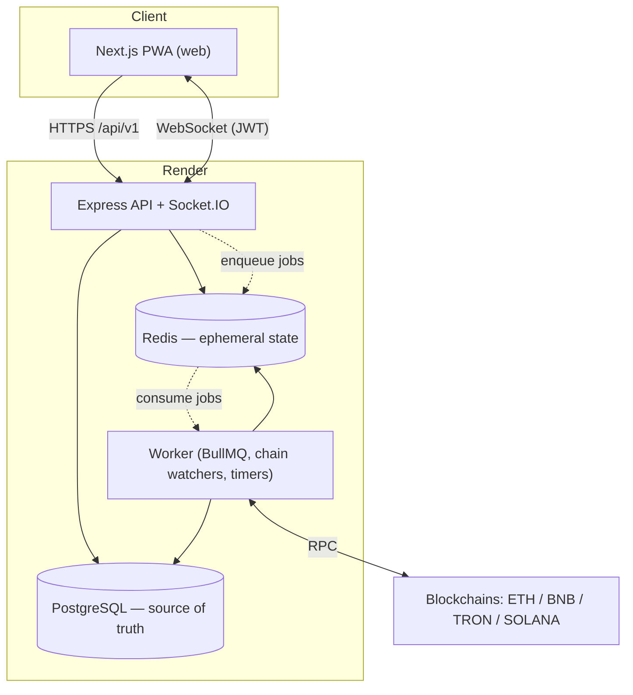

# TrustVexa Architecture

This document explains how TrustVexa is structured, how money moves safely, and where
the important logic lives. For product requirements see
`kiro/specs/trustvexa-escrow-platform/`.

## 1. Overview

TrustVexa is a crypto-only escrow platform deployed entirely on Render. It is a
TypeScript monorepo with three runtime services backed by managed PostgreSQL and Redis.



## 2. Services & packages

| Package            | Role                                                                        |
| ------------------ | --------------------------------------------------------------------------- |
| `@trustvexa/web`   | Next.js PWA: marketing site, auth, dashboards, deal UI, chat client.        |
| `@trustvexa/api`   | Express HTTP API (`/api/v1`) + Socket.IO. Layered, server-side authority.   |
| `@trustvexa/worker`| BullMQ consumers, blockchain watchers, SLA/timer sweeps, dead-letter retries.|
| `@trustvexa/shared`| Cross-cutting types & helpers: hashing (`hashLookup`), Redis, money utils.  |
| `@trustvexa/db`    | SQL migrations (with reversible `down`s) and seed data.                     |

### API layering

```
request
  → middleware chain (request-id → security headers → CORS → body parse
      → validation → JWT → role guard → rate limit → idempotency)
  → controller (HTTP translation only)
  → service (business logic, transactions)
  → repository (SQL)
  → PostgreSQL
```

Controllers never touch SQL; services never touch HTTP. All external input is validated
with Zod schemas.

## 3. Data & state ownership

- **PostgreSQL (3NF)** is the single source of truth for all durable state: users,
  deals, ledger entries, payments, payouts, policies, and audit records. Money columns
  are **integer smallest units**. Constraints (FKs, unique/partial indexes, CHECKs)
  enforce invariants at the database, e.g. `UNIQUE(tx_hash, output_index)` to prevent
  double-credits and idempotency-key uniqueness to reject replays.
- **Redis** holds only ephemeral state: rate-limit counters, the JWT `jti` denylist,
  presence, BullMQ queues, distributed locks, and caches. It never holds durable money
  state and is configured with `maxmemoryPolicy: noeviction`.

## 4. Authentication

- Email/password with **Argon2** hashing; passwords are never returned to any party.
- **Google OAuth** login: a signed, HMAC-protected `state` parameter provides
  stateless CSRF protection; the code is exchanged server-side and the verified Google
  profile is resolved to a local account (login / link / create / reject). OAuth
  sessions reuse the exact same session + JWT issuance path as password login.
- **JWT** access (short-lived) and refresh (rotating) tokens. Refresh tokens are
  rotated on use; old `jti`s are denylisted in Redis and enforced on both REST and
  WebSocket connections. Brute-force attempts trigger temporary lockout.

## 5. Deal lifecycle (state machine)

The deal lifecycle is a 20-state machine implemented in
`apps/api/src/modules/deal/state-machine.ts` (`DEAL_STATUSES`, `DEAL_EVENTS`,
`TRANSITIONS`, `nextState`, `canTransition`, `isTerminal`). Roles are `buyer`,
`seller`, and `middleman`.

High-level flow: create → invite accepted → awaiting funding → funded (on-chain
confirmed) → in progress / inspection → released to seller, or dispute → mediation →
release/refund. Funding-window and inspection-window expiries are driven by the worker
using a mockable clock so timer logic is unit-testable.

## 6. Money

All money logic is server-side and integer-only.

- **Smallest-unit primitives** convert and arithmetic on integer amounts using
  per-coin/network precision rules. Floating point is forbidden for any money
  calculation, storage, or comparison.
- **Fee engine** (`apps/api/src/modules/money/fee-engine.ts`): a 7-tier platform fee
  sliding from 5.00% to 1.35% with a `$30` minimum (`PLATFORM_FEE_MIN_CENTS`), a
  `0.5%` settlement fee (`SETTLEMENT_FEE_BPS`), and real network gas as a
  pass-through. Deal amounts are bounded to `$400`–`$50,000`
  (`DEAL_MIN_USD_CENTS` / `DEAL_MAX_USD_CENTS`). Rounding is half-up; the odd split
  cent goes to the buyer; tier boundaries resolve to the higher tier. The core
  invariant is `buyerSends === sellerReceives + platformKeeps + networkTakes`.
- **Double-entry ledger**: every value movement is recorded as balanced debits and
  credits; balances are always derived.

## 7. Realtime

Socket.IO powers chat and presence. Connections are authenticated with the same JWT and
denylist as REST. Horizontal scaling uses `@socket.io/redis-adapter`. Web-push delivers
notifications to the PWA.

## 8. Background worker

The worker runs BullMQ jobs: blockchain deposit watchers, payout/refund processing, SLA
and window timers, and notification fan-out. Failed jobs flow to a **dead-letter queue**
with exponential backoff (`nextRetryDelayMs`, capped at `MAX_BACKOFF_MS`), bounded
retries, and explicit terminal status transitions.

## 9. Launch & ops controls

- **Feature flags** (fail-closed) and **per-chain enable/disable**.
- **Emergency pause** switches per action class (new deals, deposits, payouts,
  withdrawals, signups, or a specific chain).
- **Practice (testnet) mode**: `isRealMoney` / network-mode guards prevent real-money
  actions on testnets.
- **Go-live gate**: `evaluateGoLive` returns `{ ready, blockers }`; real money is
  blocked until all blockers clear.
- **Health** roll-up: any critical dependency down → `unhealthy` (refuse traffic); any
  non-critical wobble → `degraded` (still servable).
- **Alerting** with severity thresholds.

## 10. Deployment

The entire stack is declared in [`render.yaml`](../render.yaml): `web`, `api`, and
`worker` services plus managed PostgreSQL and Redis. Connection strings are wired by
reference, JWT secrets are generated by Render, and all external credentials are set in
the dashboard (`sync: false`). The API runs `pnpm migrate:up` as a pre-deploy step.

## 11. Testing strategy

- **Unit + property-based** (Vitest + fast-check): money, fees, state machine, auth,
  launch/ops cores — these are pure and dependency-free, so they run fast and offline.
- **Integration** (DB/Redis): migrations, constraints, and service boot.
- **E2E + accessibility** (Playwright + axe-core): critical flows and WCAG 2.1 AA.

Integration and E2E suites require a real environment (database, Redis, browsers,
network) and therefore run in CI rather than offline.
